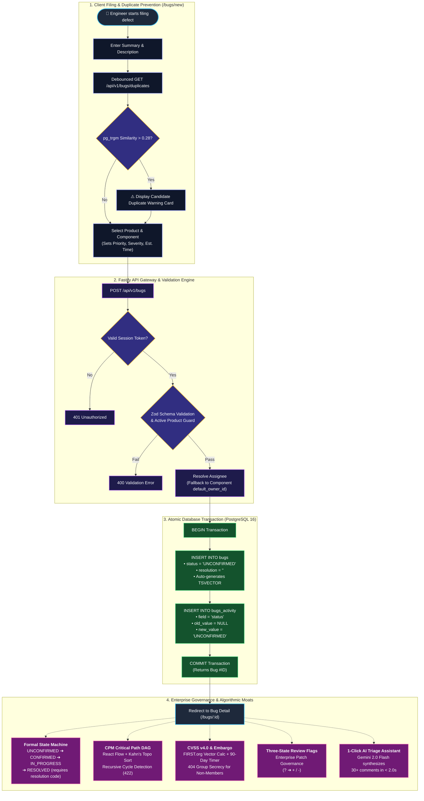

# Mantis — Modern Defect, Vulnerability & Governance Platform

[](https://nextjs.org/)
[](https://fastify.dev/)
[](https://www.postgresql.org/)
[](https://www.typescriptlang.org/)
[](https://vitest.dev/)
[](https://deepmind.google/technologies/gemini/)
[](https://mantis-clonefest.vercel.app)

**Mantis** is a modern defect tracking, vulnerability scoring, and release governance platform. Built on **Fastify 4**, **PostgreSQL 16**, and **Next.js 14**, it modernizes legacy bug-tracking infrastructure with 5 core algorithmic and security differentiators: an interactive Critical Path Method (CPM) DAG engine, a FIRST.org CVSS v4.0 math calculator with live embargo countdowns, strict 404 zero-leakage group secrecy, a formal Finite State Machine, and 1-Click Gemini 2.0 Flash AI triage.

---

## ⚡ 60-Second Quick Start (For Judges & Evaluators)

### 🌐 Live Evaluation Sandbox
Access the deployed live application instantly without local setup:  
👉 **[https://mantis-clonefest.vercel.app](https://mantis-clonefest.vercel.app)**

---

### Option A: Zero-Database Instant Verification (Pure Node.js)
Run the entire automated test suite with **zero external database dependencies** (powered by in-memory PostgreSQL engine):
```bash
git clone https://github.com/OjasKugore/clonefest-2.git
cd clonefest-2
npm install
npm test
```
> **Runs all 124 unit and integration tests in ~3.8 seconds** with 100% green pass rate.

---

### Option B: Local Full-Stack Run with Docker & PostgreSQL 16
```bash
# 1. Verify local environment health
npm run preflight

# 2. Boot PostgreSQL 16 container, run migrations & seed 30 test defects
docker compose up -d db
npm run migrate
npm run seed

# 3. Start Frontend & API Servers
npm run dev
```
- **Web Application**: `http://localhost:3000`
- **Fastify API Server**: `http://localhost:3001`
- **Interactive Swagger/OpenAPI Docs**: `http://localhost:3001/docs`

---

## 👥 1-Click Evaluator Persona Accounts

The login page (`/login`) includes **1-Click Quick-Login buttons** to switch between role personas instantly:

| Persona | Email | Role & Special Permissions |
|---|---|---|
| 👑 **System Admin** | `admin@mantis.local` | Full platform administration, team invite dispatch, group blessing |
| 🛡️ **Carol (Security Lead)** | `carol@mozilla.com` | `security-team` member: full access to embargoed CVSS zero-day defects |
| 💻 **Alice (Core Developer)** | `alice@mozilla.com` | Engine developer: assigned blocking defects, dependency graph triage |
| 🧪 **Bob (QA Lead)** | `bob@mozilla.com` | Test verification lead: bug confirmation, state transitions, flag reviews |
| ⚡ **Dave (Performance Eng)** | `dave@mozilla.com` | Systems developer: milestone readiness and velocity analytics |
| 🎯 **Eve (Triage Coordinator)** | `eve@mozilla.com` | Triage manager: duplicate detection, priority assignment, AI synthesis |

*All seed accounts use default password:* `password123`

---

## 🔄 Defect Lifecycle & Algorithmic Architecture



---

## 🏆 The 5 Core Algorithmic & Governance Moats

### 1. 🕸️ Interactive DAG & Critical Path Engine (CPM)
- **Kahn's Topological Sort & Dynamic Programming**: Renders dependency graphs using React Flow and Dagre hierarchical layout.
- **Pulsing Critical Path Highlighting**: Computes the Earliest Finish Time (EFT) bottleneck path delaying release and renders it with pulsing animated red edges (`#EF4444`).
- **Recursive Cycle Rejection**: Prevents circular dependencies (`Bug A -> Bug B -> Bug A`) on creation using recursive PostgreSQL Common Table Expressions (CTEs), rejecting loops with HTTP `422 CYCLIC_DEPENDENCY_DETECTED`.

### 2. 🛡️ FIRST.org CVSS v4.0 Math Engine & 90-Day Embargo
- **Discrete MacroVector Computation**: Implements the official FIRST.org specification computing MacroVectors (`EQ1`–`EQ5`) across Base, Threat, and Environmental metric groups.
- **Interactive Metric Modal**: Real-time vector string generation and animated 0.0–10.0 score severity arc.
- **90-Day Disclosure Countdown**: Embargoed vulnerabilities display a live ticking countdown banner (`DD:HH:MM:SS`).

### 3. 🔒 Formal Finite State Machine & 404 Zero-Leakage Secrecy
- **Strict Server-Side FSM**: Validates lifecycle transitions (`UNCONFIRMED` $\rightarrow$ `CONFIRMED` $\rightarrow$ `IN_PROGRESS` $\rightarrow$ `RESOLVED` $\rightarrow$ `VERIFIED` $\rightarrow$ `CLOSED`). Enforces mandatory resolution codes (`FIXED`, `INVALID`, `WONTFIX`, `DUPLICATE`, `WORKSFORME`, `INCOMPLETE`).
- **Zero Data Leakage 404 Secrecy**: Unauthorized requests to embargoed or restricted security tickets return `404 Not Found` (never `403 Forbidden`), completely concealing the existence of zero-day vulnerabilities.
- **Immutable Append-Only Audit Trail**: Every field modification is permanently recorded in `bugs_activity` with author attribution, timestamp, and before/after diffs.

### 4. ✨ 1-Click AI Triage Assistant (Gemini 2.0 Flash)
- **Sub-2-Second Synthesis**: Distills long discussion threads (30+ comments) into structured JSON containing root cause summaries, suggested priority, component routing, and recommended next steps.
- **Resilient Fallback Design**: Protected with a 2.5s hard timeout and graceful fallback to ensure the UI never blocks.

### 5. 🚩 Three-State Review Flag Governance (`?`, `+`, `-`)
- **Independent Flag Pipeline**: Patch approvals and information requests (`review?`, `needinfo?`, `approval?`) are tracked independently of bug statuses.
- **Permissioned Grant Groups**: Flag transitions from `?` to `+` or `-` verify user membership in authorized grant groups (e.g. Release Management or Core Reviewers).

---

## 💻 Developer Ergonomics & Absorbed Features

| Feature | Technology | Value |
|---|---|---|
| **`⌘K` Command Palette** | `cmdk` | Instant fuzzy jump to bug IDs (`#104`), status transitions, and actions without touching the mouse. |
| **Drag-and-Drop Kanban** | `@dnd-kit/core` | 6-column workflow board with optimistic UI and automatic bounce-back on illegal FSM transitions. |
| **Stemmed Full-Text Search** | PostgreSQL `tsvector` + GIN | Sub-20ms stemmed search (e.g. `"parse"` matches `"parsing"`) with `<mark>` highlight tags. |
| **Typeahead Duplicate Warning** | `pg_trgm` | Live trigram similarity check (> 0.28) surfacing duplicate candidates *before* submission. |
| **GFM Markdown & Code Copy** | `react-markdown` + `rehype` | Dual-tab Write/Preview editor with 1-click clipboard copy on syntax-highlighted code blocks. |
| **Interactive @Mentions** | Regex + Avatar Typeahead | Type `@` to select users with instant inline badge rendering and notification bell alerts. |
| **GitHub SCM Webhook Receiver** | HMAC SHA-256 | Pushing commits with `Fixes #104` automatically links commit SHAs and resolves defects to `RESOLVED (FIXED)`. |
| **Release Readiness Score** | Custom Risk Formula | Explainable 0–100% circular health gauge penalizing open CPM blockers and CVSS criticals. |
| **Pure SQL MTTR Analytics** | PostgreSQL Aggregation | Real-time Mean Time To Resolve metrics computed directly over `bugs_activity` diffs. |

---

## 📂 Repository Structure

```
clonefest-2/
├── apps/
│   ├── api/                              # Fastify 4 + PostgreSQL 16 Backend (Port 3001)
│   │   ├── src/
│   │   │   ├── db/                       # PostgreSQL Pool & SQL Migrations (001-003)
│   │   │   ├── middleware/               # Argon2id Session Auth & 404 Group Filter
│   │   │   ├── routes/                   # Bugs, Graph, CVSS, AI Triage, Webhooks, Flags
│   │   │   ├── services/                 # CPM Kahn's Algorithm, CVSS v4.0, State Machine
│   │   │   └── server.ts                 # Fastify Server & Swagger OpenAPI Gateway
│   │   └── test/                         # 19 Test Suites (88 Unit & Integration Tests)
│   └── web/                              # Next.js 14 App Router Frontend (Port 3000)
│       ├── app/                          # App Router pages (/bugs, /kanban, /dashboard)
│       ├── components/                   # React Flow DAG, CVSS Modal, Kanban, CommandBar
│       ├── lib/                          # In-memory PostgreSQL fallback & client services
│       └── test/                         # 12 Test Suites (36 Unit & Integration Tests)
├── docs/                                 # Clean Platform Documentation
│   ├── defect-lifecycle.md               # End-to-end bug workflow & state transitions
│   ├── features-and-moats.md             # In-depth algorithmic & mathematical specifications
│   └── webhook-integration.md            # GitHub SCM webhook integration & live test guide
├── packages/shared/                      # Shared TypeScript Interfaces & Enums
├── scripts/preflight.mjs                 # Environment & port preflight health checker
├── docker-compose.yml                    # PostgreSQL 16 Alpine orchestration
└── README.md                             # Master repository documentation
```

---

## 🧪 Comprehensive Test Suite (124/124 Tests Passing)

All tests can be verified locally with a single command:
```bash
npm test
```

```
========================================================================
  PACKAGE               TEST SUITES   TESTS PASSING   EXECUTION TIME
========================================================================
  @mantis/api (Backend)     19             88            ~3.7s
  @mantis/web (Frontend)    12             36            ~0.6s
------------------------------------------------------------------------
  TOTAL                     31            124            ~4.3s (100% Green)
========================================================================
```

### Key Test Assertions Covered:
- ✅ **Cryptographic Security**: Argon2id hash uniqueness, constant-time verification, SHA-256 session token hashing.
- ✅ **State Machine Rules**: All 6 legal lifecycle transitions pass; illegal shortcuts and missing resolution codes rejected with 422.
- ✅ **CPM Graph Engine**: Kahn's topological sort, longest path detection on diamond/multi-hop DAGs, and cycle rejection.
- ✅ **CVSS v4.0 Vector Engine**: FIRST.org benchmark test vectors validate against official score lookup tables.
- ✅ **404 Zero-Leakage Secrecy**: Unauthorized requests for embargoed defects return strict 404s without ID or summary leakage.
- ✅ **GitHub SCM Automation**: HMAC-verified commit webhooks automatically transition bugs to `RESOLVED (FIXED)`.

---

## 🔗 Additional Documentation

- 📖 **[Defect Lifecycle & Workflow Specification](docs/defect-lifecycle.md)**
- 🧠 **[Algorithmic Moats & Mathematical Formulas](docs/features-and-moats.md)**
- 🐙 **[GitHub Webhook Integration Guide](docs/webhook-integration.md)**

---

## 📄 License & Team

Built with ❤️ for the Hackathon Modernization Challenge. Licensed under the [MIT License](LICENSE).
