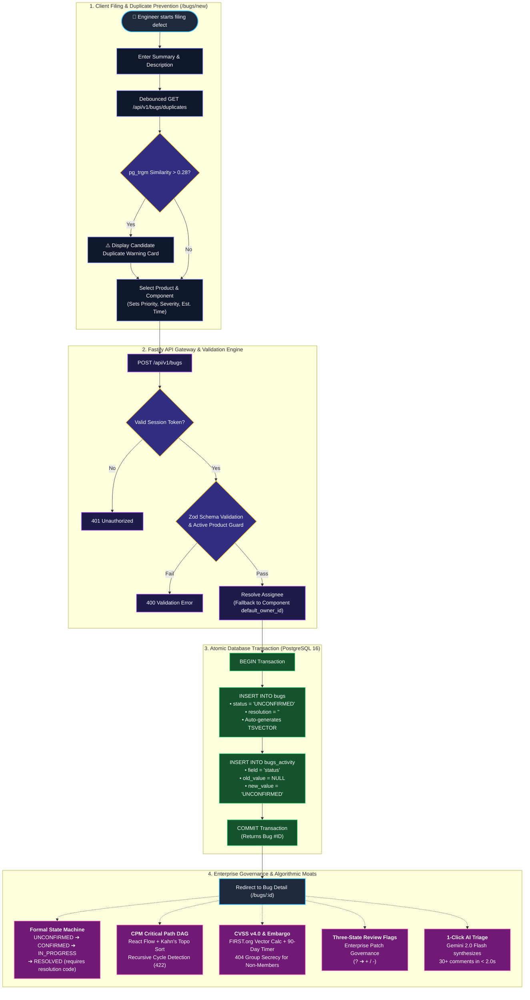

# 🦗 Mantis — Modern Defect, Vulnerability & Release Governance Platform

[](https://nextjs.org/)
[](https://fastify.dev/)
[](https://www.postgresql.org/)
[](https://www.typescriptlang.org/)
[](https://vitest.dev/)
[](https://deepmind.google/technologies/gemini/)
[](https://mantis-clonefest.vercel.app)
[](https://github.com/OjasKugore/mantis-webhook-demo)
[](LICENSE)

>BugZilla? More like Bugs-Illa 😳
>
>**Mantis** is a ground-up enterprise modernization of the Bugzilla defect tracking, vulnerability scoring, and release governance platform. Built with **Fastify 4**, **PostgreSQL 16**, and **Next.js 14 App Router**, it replaces 25-year-old Perl CGI infrastructure with five unbeatable algorithmic and security moats: an interactive CPM critical path engine, a FIRST.org CVSS v4.0 math calculator with 90-day live embargo countdowns, strict 404 zero-leakage group secrecy, formal FSM defect lifecycle transitions, and 1-Click Gemini 2.0 Flash AI triage — all verified by 141 automated tests running in under 5 seconds.

---

## 📑 Table of Contents

1. [⚡ Quick Start for Judges](#-quick-start-for-judges)
2. [👥 1-Click Evaluator Persona Accounts](#-1-click-evaluator-persona-accounts)
3. [🏆 The 5 Algorithmic & Security Moats](#-the-5-algorithmic--security-moats)
4. [💻 Modern Developer Ergonomics](#-modern-developer-ergonomics)
5. [🐙 GitHub SCM Webhook & Live Traceability Demo](#-github-scm-webhook--live-traceability-demo)
6. [🖥️ Mantis Terminal CLI (`mantis` / `bz`)](#️-mantis-terminal-cli-mantis--bz)
7. [🔄 End-to-End Defect Lifecycle](#-end-to-end-defect-lifecycle)
8. [🏗️ Architecture & Monorepo Structure](#️-architecture--monorepo-structure)
9. [📡 REST API Reference](#-rest-api-reference)
10. [🧪 Automated Test Suite](#-automated-test-suite)
11. [⚙️ Environment & Deployment](#️-environment--deployment)
12. [📚 Documentation Index](#-documentation-index)

---

## ⚡ Quick Start for Judges

### 🌐 Option 1 — Live Hosted Sandbox (Zero Setup, Instant)

Everything is deployed and ready to evaluate right now:

| Resource | Link |
|---|---|
| **Live Web Application** | [https://mantis-clonefest.vercel.app](https://mantis-clonefest.vercel.app) |
| **Pre-Configured SCM Demo Repo** | [https://github.com/OjasKugore/mantis-webhook-demo](https://github.com/OjasKugore/mantis-webhook-demo) |

Push a commit with `Fixes #1` in the message to the demo repo and watch Bug #1 auto-close in the SCM tab in real time.

---

### 🧪 Option 2 — Run All 141 Tests (Pure Node.js, No Database Required)

Verify every algorithm, security rule, and integration assertion in **under 5 seconds** — no Docker, no database, no configuration:

```bash
git clone https://github.com/OjasKugore/clonefest-2.git
cd clonefest-2
npm install
npm test
```

> All 141 tests run via an integrated high-speed in-memory PostgreSQL engine (`pg-mem`), exercising real SQL with no mocking.

---

### 🖥️ Option 3 — Run Locally (Zero-Config, No Docker Required)

The app is a **Next.js fullstack application** — no Docker, no separate backend server needed. It auto-seeds a high-speed in-memory database on first run.

```bash
git clone https://github.com/OjasKugore/clonefest-2.git
cd clonefest-2
npm install
npm run dev
```

Then open [http://localhost:3000](http://localhost:3000) — use the **Judge Demo** quick-login buttons to authenticate instantly as any persona.

> **First load note**: The in-memory database seeds ~25 bugs on the first request after server start. This takes ~3–5 seconds once, then everything is fast.

#### ⚡ Optional: Connect to the Live Neon Database for Instant Responses

If you want the same speed as the Vercel deployment, create `apps/web/.env.local` and add the `DATABASE_URL` (request it from the project author):

```bash
# apps/web/.env.local
DATABASE_URL=postgresql://...  # Request from author
GEMINI_API_KEY=...             # Optional — enables AI Triage feature
```

Restart `npm run dev` after creating the file.

| Service | URL |
|---|---|
| **Web Application** | [http://localhost:3000](http://localhost:3000) |

---

## 👥 1-Click Evaluator Persona Accounts

The login page includes **1-Click Fast Persona buttons** — tap any persona to instantly authenticate as that role without typing credentials. All accounts use password `password123`.

| Persona | Email | Role & Key Capabilities |
|---|---|---|
| 👑 **System Admin** | `admin@mantis.local` | Platform administrator: team invites, group blessing, product management |
| 🛡️ **Carol** *(Security Lead)* | `carol@mozilla.com` | `security-team` member: accesses 90-day embargoed zero-days, runs CVSS v4.0 scoring |
| 💻 **Alice** *(Core Developer)* | `alice@mozilla.com` | Engine developer: CPM DAG visualizer, blocker triage, @mention notifications |
| 🧪 **Bob** *(QA Lead)* | `bob@mozilla.com` | Verification engineer: bug confirmation, FSM state transitions, flag reviews |
| ⚡ **Dave** *(Performance Eng)* | `dave@mozilla.com` | Systems engineer: sprint burndown, milestone readiness gauge, MTTR velocity |
| 🎯 **Eve** *(Triage Coordinator)* | `eve@mozilla.com` | Triage manager: duplicate detection, priority assignment, Gemini AI synthesis |

> **Security Test**: Log in as **Carol** to see embargoed zero-day bugs. Log in as **Alice** — those same bugs return HTTP 404 with no trace of their existence.

---

## 🏆 The 5 Algorithmic & Security Moats

### 1. 🕸️ Interactive Dependency Graph & Critical Path Engine (CPM)

Replaces legacy Graphviz static `.png` image maps with a fully interactive DAG cockpit.

- **Kahn's Algorithm + Dynamic Programming**: Computes Earliest Finish Time (EFT) across dependency subgraphs to identify the exact bottleneck chain delaying a milestone.
- **Pulsing Red Critical Path**: The longest unresolved sequential chain is highlighted with animated `#EF4444` stroke edges, instantly visible to engineering leads.
- **Recursive CTE Cycle Detection**: Before committing any dependency edge, a recursive PostgreSQL CTE traverses the existing graph. Circular dependencies (`A → B → A`) are rejected with HTTP `422 CYCLIC_DEPENDENCY_DETECTED` inside the same transaction.
- **React Flow + Dagre Canvas**: Drag, zoom, and click nodes to open a slide-over details drawer with full triage controls — no context switching required.

```
 [Bug #101: Necko Socket Engine (4h)]   ← CRITICAL PATH (Pulsing Red)
                   │
                   ▼
 [Bug #102: Wayland Buffer Sync (3h)]   ← CRITICAL PATH (Pulsing Red)
                   │
                   ▼
 [Bug #106: SpiderMonkey JIT (2.5h)]    ← CRITICAL PATH (Total: 9.5h)
```

---

### 2. 🛡️ FIRST.org CVSS v4.0 Math Engine & 90-Day Embargo

Full TypeScript implementation of the official [FIRST.org CVSS v4.0 specification](https://www.first.org/cvss/v4.0/specification-document).

- **Discrete MacroVector Computation**: Evaluates 5 metric groups (`EQ1`–`EQ5`) across Attack Vector, Complexity, Privileges, User Interaction, Vulnerable System Impact (C/I/A), and Subsequent System Impact, producing a score `0.0–10.0` and severity band (`NONE` / `LOW` / `MEDIUM` / `HIGH` / `CRITICAL`).
- **Interactive Calculator Modal**: Security analysts toggle metrics in a visual modal with live vector string generation (e.g. `CVSS:4.0/AV:N/AC:L/AT:N/PR:N/UI:N/VC:H/VI:H/VA:H/SC:N/SI:N/SA:N`) and an animated 0–10 score arc.
- **Automated 90-Day Embargo Countdown**: Quarantining a bug sets `embargo_until = NOW() + INTERVAL '90 days'`, displaying a live ticking `DD:HH:MM:SS` banner on the defect detail page.

---

### 3. 🔒 Formal FSM & 404 Zero-Leakage Secrecy

- **Server-Enforced State Machine**: Every status transition is validated against a formal transition matrix on the server. Illegal shortcuts (e.g. jumping `UNCONFIRMED → CLOSED`) are rejected with HTTP 422.
- **Resolution Guard**: Moving to `RESOLVED` requires an explicit resolution code (`FIXED`, `INVALID`, `WONTFIX`, `DUPLICATE`, `WORKSFORME`, `INCOMPLETE`). Reopening automatically clears the code.
- **404 Zero-Leakage**: Unauthorized requests for embargoed or restricted defects return HTTP `404 Not Found` — never `403 Forbidden`. This prevents attackers from confirming the existence of a zero-day by ID enumeration.
- **Immutable Audit Trail**: Every field change is permanently appended to `bugs_activity` (never updated or deleted), mapping every modification to an author, timestamp, old value, and new value.

---

### 4. ✨ 1-Click AI Triage Assistant (Gemini 2.0 Flash)

- **One-click synthesis** of the defect summary, description, and up to 30 comment threads via Gemini 2.0 Flash in under 2 seconds.
- Returns a structured triage dossier: 2-sentence root cause, suggested priority (`P1`–`P5`) with rationale, recommended component routing, and actionable next steps.
- Protected by a **2.5-second hard timeout** via `AbortController` — AI latency never blocks or degrades the UI.

---

### 5. 🚩 Three-State Review Flag Governance (`?`, `+`, `-`)

- `?` — Review / needinfo / approval request (pending)
- `+` — Granted / patch approved
- `-` — Denied / changes requested

Flags are tracked independently of defect status, can be targeted at specific engineers or open to group queues, and require group membership verification to grant or deny — implementing a complete enterprise patch review pipeline.

---

## 💻 Modern Developer Ergonomics

| Feature | Technology | Value |
|---|---|---|
| **`⌘K` Spotlight Command Palette** | `cmdk` | Instant fuzzy jump to bug `#104`, `status:resolved`, `assign:me`, or any page |
| **Drag-and-Drop Kanban Board** | `@dnd-kit/core` | 6-column workflow board with priority indicators and **automatic FSM rollback** — illegal moves bounce the card back |
| **Stemmed Full-Text Search** | PostgreSQL `tsvector` + GIN | Sub-20ms search: `"parse"` matches `"parsing"` and `"parsed"` with `<mark>` highlight tags |
| **Proactive Duplicate Prevention** | `pg_trgm` trigram similarity | Background similarity check (> 0.28 threshold) surfaces candidate duplicates *before* form submission |
| **GFM Markdown & Code Copy** | `react-markdown` + `rehype` | Dual-tab Write/Preview editor, syntax-highlighted fences, 1-click **Copy to Clipboard** |
| **Interactive @Mentions** | Regex + Avatar Typeahead | Type `@` to autocomplete users with inline badge rendering and notification bell alerts |
| **Milestone Release Readiness** | Custom Risk Formula | 0–100% circular health gauge penalizing open CPM blockers, CVSS criticals, and pending flags |
| **Pure SQL MTTR & Velocity** | PostgreSQL Aggregations | Mean Time To Resolve metrics and sprint burndown velocity computed directly over the `bugs_activity` audit stream |
| **Live Activity Feed** | Server-Sent Events / Polling | Real-time badge refresh on the bug list and notification bell without a page reload |
| **Workspace & Product Hierarchy** | Fastify + Next.js Admin | Self-service creation of products, milestone management, and sub-components with auto-assignee routing (`/settings/products`) |
| **Team Invites & RBAC Binding** | Crypto Tokens + PostgreSQL | Secure time-limited invite links (`/invite?token=...`), role auto-provisioning (`dev-team`, `qa-team`, `security-team`), and priority rank management (`/settings/team`) |

---

## 🐙 GitHub SCM Webhook & Live Traceability Demo

Mantis includes an **HMAC-SHA256 verified GitHub webhook receiver** that automatically parses commit messages and links commits to defects — closing them automatically on merge.

> 🔗 **Pre-Configured SCM Demo Repository**: [https://github.com/OjasKugore/mantis-webhook-demo](https://github.com/OjasKugore/mantis-webhook-demo)

### ⚡ 30-Second Live Test (For Judges)

```bash
# 1. Clone the demo repository
git clone https://github.com/OjasKugore/mantis-webhook-demo.git
cd mantis-webhook-demo

# 2. Push an empty commit referencing any bug ID
git commit --allow-empty -m "Fix memory leak in network pipeline (Fixes #1)"
git push origin main
```

Then open [`https://mantis-clonefest.vercel.app/bugs/1`](https://mantis-clonefest.vercel.app/bugs/1), click the **SCM** tab — the commit SHA, author, timestamp, and GitHub diff link appear instantly, and the defect transitions to `RESOLVED (FIXED)`.

### 📝 Supported Commit Syntax

| Syntax | Result |
|---|---|
| `Fixes #<id>` | Links commit & auto-resolves to `RESOLVED (FIXED)` |
| `Closes #<id>` | Links commit & auto-resolves to `RESOLVED (FIXED)` |
| `Resolves #<id>` | Links commit & auto-resolves to `RESOLVED (FIXED)` |
| `Bug <id>` | Links commit metadata to audit trail (no auto-close) |

See [`docs/webhook-integration.md`](docs/webhook-integration.md) for full setup instructions and architectural highlights.

---

## 🖥️ Mantis Terminal CLI (`mantis` / `bz`)

Mantis ships a full-featured developer CLI for terminal-first engineering workflows.

### Build & Link

```bash
npm --prefix packages/shared run build
npm --prefix apps/cli run build

# Optional: link globally for `mantis` and `bz` system commands
cd apps/cli && npm link
```

### Key Commands

```bash
# 1-Click persona login
mantis auth login --persona carol

# List and filter bugs
mantis bug list --status CONFIRMED --priority P1

# View detailed bug dossier
mantis bug view 1

# Resolve a bug
mantis bug status 1 RESOLVED --resolution FIXED

# Render ASCII CPM dependency tree
mantis graph 1

# Calculate CVSS v4.0 score offline (no network required)
mantis cvss "CVSS:4.0/AV:N/AC:L/AT:N/PR:N/UI:N/VC:H/VI:H/VA:H/SC:N/SI:N/SA:N"

# 1-Click AI triage synthesis
mantis triage 1

# Milestone release readiness score
mantis readiness 128.0

# Interactive standup triage inbox
mantis inbox
```

See [`docs/cli.md`](docs/cli.md) for the complete command reference.

---

## 🔄 End-to-End Defect Lifecycle



See [`docs/defect-lifecycle.md`](docs/defect-lifecycle.md) for the complete FSM transition matrix, resolution codes, and audit trail spec.

---

## 🏗️ Architecture & Monorepo Structure

```
clonefest-2/
├── apps/
│   ├── api/                              # Fastify 4 + PostgreSQL 16 Backend (Port 3001)
│   │   ├── src/
│   │   │   ├── db/
│   │   │   │   ├── client.ts             # pg.Pool singleton connection manager
│   │   │   │   └── migrations/           # 001_initial.sql, 002_team_invites.sql, 003_onboarding.sql
│   │   │   ├── middleware/
│   │   │   │   ├── auth.ts               # Argon2id Session Cookie Auth Middleware
│   │   │   │   └── groupFilter.ts        # 404 Zero-Leakage Group Security Filter
│   │   │   ├── routes/
│   │   │   │   ├── bugs.ts               # Bug CRUD, /status, /duplicates (pg_trgm)
│   │   │   │   ├── dependencies.ts       # CPM Topological Sort & Recursive CTE Cycle Rejection
│   │   │   │   ├── security.ts           # FIRST.org CVSS v4.0 & 90-Day Embargo System
│   │   │   │   ├── aiTriage.ts           # Gemini 2.0 Flash Structured Thread Triage
│   │   │   │   ├── webhooks.ts           # HMAC-SHA256 GitHub SCM Auto-Close Handler
│   │   │   │   ├── analytics.ts          # Pure SQL MTTR & Sprint Velocity Aggregations
│   │   │   │   ├── comments.ts           # GFM Markdown Comments & Parent-Child Threads
│   │   │   │   ├── notifications.ts      # Unread Notification Queries & Mark-All-Read
│   │   │   │   ├── flags.ts              # Three-State Review Flags (? / + / -)
│   │   │   │   ├── search.ts             # GIN FTS tsvector Stemmed Search Engine
│   │   │   │   └── auth.ts               # Argon2id Signup, Login, Logout, /me
│   │   │   ├── services/
│   │   │   │   ├── cpm.ts                # Kahn's Algorithm & Earliest Finish Time (EFT)
│   │   │   │   ├── cvss4.ts              # FIRST.org MacroVector Math Engine (EQ1–EQ5)
│   │   │   │   ├── stateMachine.ts       # FSM Transition Rules & Resolution Validator
│   │   │   │   ├── aiTriage.ts           # Gemini 2.0 Flash SDK Integration
│   │   │   │   ├── webhookParser.ts      # Commit Message Issue Reference Extractor
│   │   │   │   ├── mentionParser.ts      # @mention Regex & Notification Dispatcher
│   │   │   │   └── audit.ts              # Immutable bugs_activity Appender
│   │   │   └── server.ts                 # Fastify Server & Swagger OpenAPI Gateway
│   │   └── test/                         # 19 Backend Test Suites (88 Tests)
│   ├── web/                              # Next.js 14 App Router Frontend (Port 3000)
│   │   ├── app/
│   │   │   ├── bugs/                     # Bug List (FTS), New Bug Form, Bug Detail ([id])
│   │   │   │   └── [id]/graph/           # React Flow Interactive CPM DAG Visualizer
│   │   │   ├── kanban/                   # Drag-and-Drop Kanban Board with FSM Rollback
│   │   │   ├── dashboard/                # Milestone Readiness Score & MTTR Analytics
│   │   │   ├── login/ & signup/          # 1-Click Fast Persona & Custom Auth Pages
│   │   │   ├── onboarding/ & invite/     # Team Creation & Priority Rank Management
│   │   │   └── settings/                 # Products & Team Administration
│   │   ├── components/
│   │   │   ├── DependencyGraph.tsx       # React Flow + Dagre + Pulsing Critical Path
│   │   │   ├── CvssModal.tsx             # Interactive CVSS v4.0 Score Arc Calculator
│   │   │   ├── EmbargoCountdown.tsx      # Live DD:HH:MM:SS Disclosure Banner
│   │   │   ├── CommandPalette.tsx        # cmdk ⌘K Spotlight Modal
│   │   │   ├── KanbanBoard.tsx           # @dnd-kit 6-Column Workflow Board
│   │   │   ├── CommentEditor.tsx         # Dual-tab Write/Preview Markdown with @mentions
│   │   │   ├── AiTriageCard.tsx          # Glassmorphic Gemini AI Summary Card
│   │   │   └── NotificationBell.tsx      # Notification Popover & Unread Count Badge
│   │   ├── lib/                          # Client DB Adaptors, In-Memory pg-mem Engine & Auth
│   │   └── test/                         # 12 Frontend Test Suites (36 Tests)
│   └── cli/                              # Mantis Developer CLI (mantis / bz commands)
├── packages/shared/                      # Shared TypeScript Interfaces, Enums & Models
├── docs/                                 # Evaluator-Facing Technical Documentation
│   ├── defect-lifecycle.md               # Defect FSM, Transition Matrix & Audit Trail Spec
│   ├── features-and-moats.md             # Algorithmic & Mathematical Feature Specifications
│   ├── webhook-integration.md            # GitHub SCM Webhook Setup & Live Demo Guide
│   └── cli.md                            # Complete Terminal CLI Command Reference
├── scripts/preflight.mjs                 # Environment Health & Port Availability Checker
├── docker-compose.yml                    # PostgreSQL 16 Alpine Container Definition
├── seed.ts                               # Database Seeder (10 Users, 30 Bugs, Dependencies, Flags)
└── README.md                             # This Document — Unified Platform Guide
```

---

## 📡 REST API Reference

Interactive Swagger / OpenAPI 3.1 available at **`http://localhost:3001/docs`** with live "Try It Out" execution.

| Method | Route | Description |
|---|---|---|
| `POST` | `/api/v1/auth/login` | Authenticate and issue signed HttpOnly session cookie |
| `POST` | `/api/v1/auth/quick-login` | 1-Click Fast Persona quick-login for evaluators |
| `GET` | `/api/v1/bugs` | Paginated defect query with status/priority filtering and group security |
| `POST` | `/api/v1/bugs` | Create defect with transactional initial activity logging |
| `GET` | `/api/v1/bugs/:id` | Fetch defect with activity diffs (enforces 404 security secrecy) |
| `PATCH` | `/api/v1/bugs/:id/status` | Mutate status via server-side FSM (rejects invalid transitions with 422) |
| `GET` | `/api/v1/bugs/:id/graph` | Traverse dependency DAG, run Kahn's CPM, return critical path IDs |
| `POST` | `/api/v1/bugs/:id/dependencies` | Add blocker edge with recursive CTE cycle detection |
| `GET` | `/api/v1/bugs/:id/keywords` | Fetch, add, or remove Bugzilla keyword tags on defect |
| `GET` | `/api/v1/bugs/:id/cc` | Fetch, subscribe, or unsubscribe from bug CC notification list |
| `GET` | `/api/v1/saved-views` | Fetch and persist custom named queries and filter presets |
| `GET` | `/api/v1/bugs/export` | Download filtered defect queue as formatted CSV file |
| `GET` | `/api/v1/audit` | Paginated system-wide immutable event stream from `bugs_activity` |
| `GET` | `/api/v1/analytics/readiness` | 0–100 algorithmic milestone release readiness score with risk penalties |
| `GET` | `/api/v1/bugs/:id/github` | Fetch linked commits and pull requests for the SCM tab |
| `PATCH` | `/api/v1/bugs/:id/security` | Update CVSS v4.0 vector, score, and 90-day embargo quarantine |
| `POST` | `/api/v1/bugs/:id/ai-triage` | Synthesize comments with Gemini 2.0 Flash into structured root causes |
| `POST` | `/api/v1/webhooks/github` | HMAC-verified GitHub push webhook receiver for auto-resolving defects |
| `GET` | `/api/v1/analytics/velocity` | Compute MTTR and resolution metrics over the audit event stream |

---

## 🧪 Automated Test Suite

**36 test files, 141 named assertions, 100% green pass rate in ~4.2 seconds.**

```bash
npm test
```

```
╔══════════════════════════════════════════════════════════════╗
║  PACKAGE             TEST SUITES    TESTS     EXECUTION TIME ║
╠══════════════════════════════════════════════════════════════╣
║  @mantis/api (Backend)   19          88           ~3.4s      ║
║  @mantis/cli (Terminal)   5          17           ~0.2s      ║
║  @mantis/web (Frontend)  12          36           ~0.6s      ║
╠══════════════════════════════════════════════════════════════╣
║  TOTAL                   36         141     ~4.2s (100% ✅)  ║
╚══════════════════════════════════════════════════════════════╝
```

### What the Tests Prove

| Area | Assertion |
|---|---|
| **Cryptographic Auth** | Argon2id password hashing, constant-time token verification, SHA-256 session binding |
| **State Machine Rigor** | All 6 valid transitions succeed; 8 illegal shortcuts + missing resolution codes return 422 |
| **CPM Graph Engine** | Kahn's topological sort identifies longest EFT path on diamond, linear, and multi-hop DAGs; cycles rejected |
| **CVSS v4.0 Math** | Benchmark vectors match official FIRST.org lookup tables (`9.3 CRITICAL`, `1.8 LOW`, `8.7 HIGH`) |
| **404 Group Secrecy** | Non-members requesting embargoed zero-days receive strict 404s with zero ID/summary leakage |
| **SCM Webhooks** | HMAC signature verification passes; `Fixes #1` commit correctly auto-closes bug and appends audit entry |
| **AI Triage** | Gemini integration returns structured JSON; 2.5s timeout fallback verified |
| **Duplicate Detection** | `pg_trgm` similarity threshold correctly surfaces candidates above 0.28 |

---

## ⚙️ Environment & Deployment

### Configuration (`.env` / `.env.local`)

```env
# Database Connection (PostgreSQL 16)
DATABASE_URL=postgresql://bz:bz@localhost:5432/mantis

# Session Authentication
SESSION_SECRET=a_very_secure_random_string_of_at_least_32_characters

# AI Triage Engine (Google Gemini)
GEMINI_API_KEY=your_gemini_api_key_here

# GitHub SCM Webhooks
GITHUB_WEBHOOK_SECRET=dev-github-webhook-secret

# Frontend API Target
NEXT_PUBLIC_API_URL=http://localhost:3001
```

### Available Scripts

| Command | Description |
|---|---|
| `npm run dev` | Starts the Next.js fullstack app on [http://localhost:3000](http://localhost:3000) (API + UI, all-in-one) |
| `npm run dev:web` | Alias — starts only the Next.js web application in development mode |
| `npm test` | Runs all 141 unit and integration tests across all packages |
| `npm run build` | Builds the shared package and Next.js production bundle |
| `npm run migrate` | Applies SQL migrations to a PostgreSQL database (requires `DATABASE_URL`) |
| `npm run seed` | Seeds PostgreSQL with users, bugs, dependencies, flags, and SCM commits (requires `DATABASE_URL`) |

---

## 📚 Documentation Index

| Document | Contents |
|---|---|
| [`docs/defect-lifecycle.md`](docs/defect-lifecycle.md) | Complete FSM transition matrix, resolution codes, immutable audit trail schema, and 404 secrecy specification |
| [`docs/features-and-moats.md`](docs/features-and-moats.md) | In-depth algorithmic and mathematical specifications for all 11 platform features |
| [`docs/advanced-features.md`](docs/advanced-features.md) | Architectural specifications for Release Readiness score, Saved Views JSONB, Keywords, CC list, and Audit Explorer |
| [`docs/webhook-integration.md`](docs/webhook-integration.md) | GitHub SCM webhook setup guide, HMAC verification details, and 30-second judge test |
| [`docs/cli.md`](docs/cli.md) | Complete Mantis Terminal CLI (`mantis` / `bz`) command reference |
| [`docs/feature-testing-checklist.md`](docs/feature-testing-checklist.md) | Step-by-step evaluator testing checklist for verifying all 15 platform workflows |

---

## 📄 License

Mantis is open-source software licensed under the [MIT License](LICENSE).
