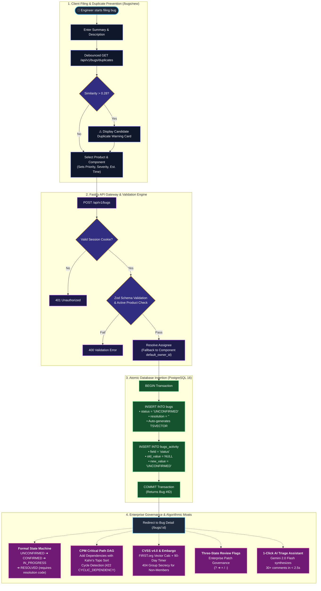

# Bug Reporting & Enterprise Lifecycle Workflow

This document illustrates the complete end-to-end bug reporting, duplicate prevention, and governance lifecycle in Mantis.

```mermaid
flowchart TD
    %% Styling and layout
    classDef startEnd fill:#1E293B,stroke:#38BDF8,stroke-width:2px,color:#F8FAFC;
    classDef client fill:#0F172A,stroke:#818CF8,stroke-width:1.5px,color:#F8FAFC;
    classDef server fill:#1E1B4B,stroke:#A855F7,stroke-width:1.5px,color:#F8FAFC;
    classDef database fill:#14532D,stroke:#4ADE80,stroke-width:1.5px,color:#F8FAFC;
    classDef moat fill:#701A75,stroke:#F472B6,stroke-width:1.5px,color:#F8FAFC;
    classDef decision fill:#312E81,stroke:#FBBF24,stroke-width:1.5px,color:#F8FAFC;

    %% 1. User Input & Live Assist
    subgraph S1 ["1. Client Filing & Duplicate Prevention (/bugs/new)"]
        START(["👤 Engineer starts filing bug"]):::startEnd
        INPUT["Enter Summary & Description"]:::client
        TRGM_QUERY["Debounced GET /api/v1/bugs/duplicates"]:::client
        CHECK_DUP{"Similarity > 0.28?"}:::decision
        WARN_CARD["⚠️ Display Candidate Duplicate Warning Card"]:::client
        USER_CONTINUE["Select Product & Component<br/>(Sets Priority, Severity, Est. Time)"]:::client
    end

    %% 2. Backend Validation & Ingestion
    subgraph S2 ["2. Fastify API Gateway & Validation Engine"]
        SUBMIT["POST /api/v1/bugs"]:::server
        AUTH_CHECK{"Valid Session Cookie?"}:::decision
        AUTH_ERR["401 Unauthorized"]:::server
        ZOD_CHECK{"Zod Schema Validation<br/>& Active Product Check"}:::decision
        VAL_ERR["400 Validation Error"]:::server
        OWNER_RESOLVE["Resolve Assignee<br/>(Fallback to Component default_owner_id)"]:::server
    end

    %% 3. PostgreSQL Transaction & Audit
    subgraph S3 ["3. Atomic Database Insertion (PostgreSQL 16)"]
        DB_TX["BEGIN Transaction"]:::database
        INSERT_BUG["INSERT INTO bugs<br/>• status = 'UNCONFIRMED'<br/>• resolution = ''<br/>• Auto-generates TSVECTOR"]:::database
        INSERT_AUDIT["INSERT INTO bugs_activity<br/>• field = 'status'<br/>• old_value = NULL<br/>• new_value = 'UNCONFIRMED'"]:::database
        DB_COMMIT["COMMIT Transaction<br/>(Returns Bug #ID)"]:::database
    end

    %% 4. Downstream Moats & Lifecycle
    subgraph S4 ["4. Enterprise Governance & Algorithmic Moats"]
        DETAIL_PAGE["Redirect to Bug Detail (/bugs/:id)"]:::startEnd
        
        M_FSM["<b>Formal State Machine</b><br/>UNCONFIRMED ➔ CONFIRMED ➔ IN_PROGRESS<br/>➔ RESOLVED (requires resolution code)"]:::moat
        M_CPM["<b>CPM Critical Path DAG</b><br/>Add Dependencies with Kahn's Topo Sort<br/>Cycle Detection (422 CYCLIC_DEPENDENCY)"]:::moat
        M_CVSS["<b>CVSS v4.0 & Embargo</b><br/>FIRST.org Vector Calc + 90-Day Timer<br/>404 Group Secrecy for Non-Members"]:::moat
        M_FLAGS["<b>Three-State Review Flags</b><br/>Enterprise Patch Governance<br/>(? ➔ + / -)"]:::moat
        M_AI["<b>1-Click AI Triage Assistant</b><br/>Gemini 2.0 Flash synthesizes<br/>30+ comments in < 2.5s"]:::moat
    end

    %% Connections
    START --> INPUT
    INPUT --> TRGM_QUERY
    TRGM_QUERY --> CHECK_DUP
    CHECK_DUP -- Yes --> WARN_CARD
    CHECK_DUP -- No --> USER_CONTINUE
    WARN_CARD --> USER_CONTINUE
    USER_CONTINUE --> SUBMIT

    SUBMIT --> AUTH_CHECK
    AUTH_CHECK -- No --> AUTH_ERR
    AUTH_CHECK -- Yes --> ZOD_CHECK
    ZOD_CHECK -- Fail --> VAL_ERR
    ZOD_CHECK -- Pass --> OWNER_RESOLVE

    OWNER_RESOLVE --> DB_TX
    DB_TX --> INSERT_BUG
    INSERT_BUG --> INSERT_AUDIT
    INSERT_AUDIT --> DB_COMMIT

    DB_COMMIT --> DETAIL_PAGE

    DETAIL_PAGE -.-> M_FSM
    DETAIL_PAGE -.-> M_CPM
    DETAIL_PAGE -.-> M_CVSS
    DETAIL_PAGE -.-> M_FLAGS
    DETAIL_PAGE -.-> M_AI
```
