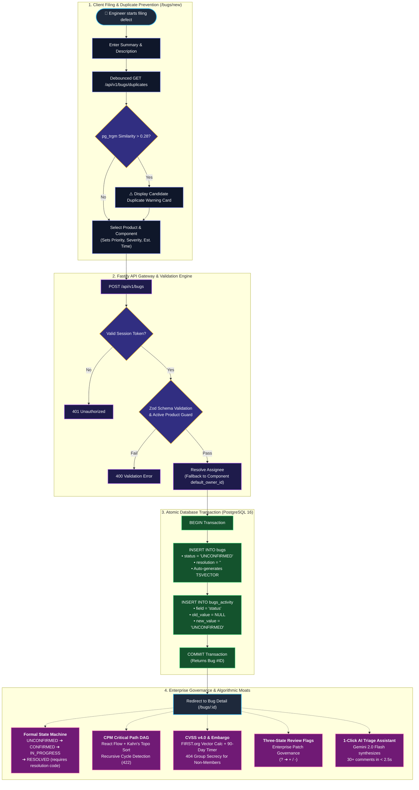

# Mantis — Defect Lifecycle & Formal State Machine

> **Live Evaluation Sandbox:** [https://mantis-clonefest.vercel.app](https://mantis-clonefest.vercel.app)

This document specifies the complete defect lifecycle in Mantis: from the moment an engineer files a bug to permanent archival, covering state transition rules, resolution requirements, audit trail mechanics, and security isolation.

---

## 1. End-to-End Filing & Lifecycle Flow



---

## 2. Formal Finite State Machine (FSM)

### 2.1 State Transition Diagram

```
UNCONFIRMED ──► CONFIRMED ──► IN_PROGRESS ──► RESOLVED ──► VERIFIED ──► CLOSED
                    ▲              │              │            │
                    └──────────────┴──────────────┴────────────┘  (Reopen)
```

### 2.2 Permitted Transition Matrix

| Current Status | Permitted Target Statuses | Notes |
|---|---|---|
| `UNCONFIRMED` | `CONFIRMED`, `RESOLVED` | Initial state for all new defects |
| `CONFIRMED` | `IN_PROGRESS`, `RESOLVED` | Confirmed bugs awaiting assignment |
| `IN_PROGRESS` | `RESOLVED`, `CONFIRMED` | Active work; revert to `CONFIRMED` on unassignment |
| `RESOLVED` | `VERIFIED`, `CONFIRMED` | Resolution must be set; reopen clears resolution |
| `VERIFIED` | `CLOSED`, `CONFIRMED` | QA-verified fix; reopen if regression found |
| `CLOSED` | `CONFIRMED` | Permanent archival; reopen only to restart triage |

Any transition not listed above is rejected by the server with **HTTP 422 Unprocessable Entity**.

### 2.3 Resolution Guard

Transitioning any defect to `RESOLVED` **requires** one of the following mandatory resolution codes:

| Resolution Code | Meaning |
|---|---|
| `FIXED` | The defect has been fixed in the codebase |
| `INVALID` | The report does not describe a real defect |
| `WONTFIX` | A known issue accepted as out of scope |
| `DUPLICATE` | A duplicate of another existing report |
| `WORKSFORME` | Could not reproduce with provided steps |
| `INCOMPLETE` | Insufficient information to act upon |

Reopening a defect (transitioning back to `CONFIRMED`) **automatically clears** the resolution code field.

---

## 3. Immutable Audit Trail

Every field mutation — status changes, priority edits, CVSS vector updates, embargo toggles, assignee changes — is permanently recorded in the `bugs_activity` table:

```sql
CREATE TABLE bugs_activity (
    id          UUID PRIMARY KEY DEFAULT gen_random_uuid(),
    bug_id      BIGINT NOT NULL REFERENCES bugs(id) ON DELETE CASCADE,
    who_id      UUID NOT NULL REFERENCES users(id),
    field       VARCHAR(64) NOT NULL,
    old_value   TEXT,
    new_value   TEXT,
    comment     TEXT,
    changed_at  TIMESTAMPTZ NOT NULL DEFAULT NOW()
);
```

- Rows are **never updated or deleted** — the table is append-only.
- Provides a complete, timestamped chain of custody for every defect.
- Supports SOC 2 and ISO 27001 audit compliance requirements.

---

## 4. 404 Zero-Leakage Secrecy

When an unauthorized user (or unauthenticated request) attempts to access a quarantined security defect:

- The server returns **HTTP `404 Not Found`** — never `403 Forbidden`.
- The response body contains no bug ID, summary, or any field from the restricted record.
- This prevents attackers from enumerating bug IDs or confirming the existence of an active zero-day vulnerability under 90-day disclosure embargo.

Security bugs are visible **only** to members of the designated `security-team` group, as verified against the session cookie on every request.

---

## 5. Duplicate Prevention (Pre-Submission)

Before an engineer submits a new bug, Mantis runs a background trigram similarity query:

```sql
SELECT id, summary, similarity(summary, $1) AS score
FROM bugs
WHERE similarity(summary, $1) > 0.28
ORDER BY score DESC
LIMIT 5;
```

If candidates exist, a warning card surfaces their IDs and summaries directly in the bug filing form — allowing the engineer to check and link the existing report instead of creating a duplicate.
