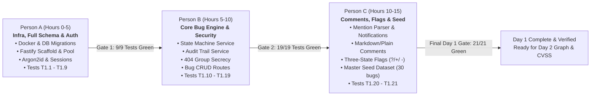

# BugzillaRevamp — Full Implementation Plan
### Hard Deadline: August 30, 2026 at 11:59 PM IST (72-Hour Sprint)

> This plan is the single source of truth for building the BugzillaRevamp. Every feature includes step-by-step build instructions, exact TypeScript/SQL stubs, UI component hierarchy, edge cases to handle, and a named test for every assertion. Each day ends with a mandatory test gate — zero regressions before the next day starts.

---

## Executive Summary: 3-Member Sequential Split (Day 1)

> **Execution Protocol**: Strictly sequential (Person A → Person B → Person C). Zero parallel conflicts. Each person begins only when the preceding person's verification gate passes 100%.

| Member | Stage | Timebox | Deliverables | Tests | Handoff Contract to Next Person |
|---|---|---|---|---|---|
| **Person A** | 1.A | Hours 0–5 | Monorepo scaffold (`npm workspaces`), `docker-compose.yml`, full 16-table PostgreSQL DDL (`001_initial.sql`), Fastify 4 app skeleton + `pg.Pool`, Argon2id crypto, session store & `authMiddleware`, Auth routes (`/signup`, `/login`, `/logout`, `/me`) | T1.1–T1.9 (9 tests) | **Gate 1 (9/9 pass)**: DB healthy on port 5432, Fastify boots on 3001, `authMiddleware` exported, test user helpers ready in `test/helpers/setup.ts` |
| **Person B** | 1.B | Hours 5–10 | State machine service (`VALID_TRANSITIONS`), append-only audit trail (`bugs_activity`), 404 security group filter (`applyGroupFilter`), Bug CRUD routes (`POST /bugs`, `GET /bugs`, `GET /bugs/:id`, `PATCH /bugs/:id`, `PATCH /bugs/:id/status`) | T1.10–T1.19 (10 tests) | **Gate 2 (19/19 pass)**: Working bug CRUD & status endpoints at `/api/v1/bugs`, `recordActivity()` exported, `createTestBug()` ready in test harness |
| **Person C** | 1.C | Hours 10–15 | `@mention` regex parser, Comment routes with Markdown/Plain support, in-app notifications, Three-State Flags (`?` → `+`/`-`), Master Seed data generator (30 bugs, 10 users, 2 flag types, groups, keywords) | T1.20–T1.21 (2 tests) + Full Regression | **Final Day 1 Gate (21/21 pass)**: Database seeded with 30 realistic bugs, all 21 Day 1 tests 100% green, Swagger UI (`/docs`) operational |

---

## Decisions Locked (from /grill-me session, Aug 28 10:40 AM IST)

| Decision | Choice | Impact |
|---|---|---|
| **Starting point** | Empty `clonefest-2/` folder | Scaffold everything from scratch |
| **Deliverable** | Live Docker URL + GitHub repo | No PDF needed |
| **AI Triage model** | **Gemini 2.0 Flash** (user's key) | Replace OpenAI calls with `@google/generative-ai` SDK |
| **Webhook demo** | Real GitHub repo + **ngrok** tunnel | Most impressive; README includes ngrok setup instructions |
| **Default theme** | **Dark mode** default + light toggle | Persist in `localStorage` via `next-themes` |
| **Monorepo** | **npm workspaces** | Root `package.json` with `apps/api`, `apps/web`, `packages/shared` |
| **Attachments** | **Local disk upload** (`/uploads` Docker volume) | Complete feature, ~2h on Day 3 after other features |
| **E2E tests** | **Skip** Playwright/Cypress | 39 Vitest unit + integration tests only |
| **Build order** | Strict **Day 1 → 2 → 3** | No parallelization |

---

## Tech Stack (Locked — No Deviation)

| Layer | Technology | Rationale |
|---|---|---|
| **Database** | PostgreSQL 16 | `tsvector`/GIN FTS, recursive CTEs for DAGs, `TIMESTAMPTZ`, JSONB, native constraints |
| **Backend** | Node.js 20 + Fastify 4 + TypeScript 5 | Sub-ms route overhead, TypeBox schema validation, single language |
| **API** | RESTful JSON only | No GraphQL — two surfaces with zero extra rubric gain |
| **Frontend** | Next.js 14 (App Router) + React 18 + Tailwind CSS + shadcn/ui | SSR, CSS variables for dark/light, `@xyflow/react`, `cmdk`, `@dnd-kit` |
| **Auth** | Argon2id + HTTP-Only Signed Session Cookies | Bulletproof; no OAuth complexity |
| **Search** | PostgreSQL `tsvector` + GIN index | Sub-20ms, no external daemon |
| **Graph** | `@xyflow/react` (React Flow) + `dagre` | Synchronous layout, no Web Worker needed |
| **DnD** | `@dnd-kit/core` | Kanban board |
| **Command Palette** | `cmdk` (shadcn CommandDialog) | Sub-10ms fuzzy keyboard nav |
| **Markdown** | `react-markdown` + `remark-gfm` + `rehype-highlight` + `marked` + `DOMPurify` | Client render + server sanitization |
| **Testing** | Vitest (unit) + Fastify `inject` / Supertest (integration) | Sub-second test execution |
| **Dev Infra** | Docker Compose (PostgreSQL + API + Next.js) | Single `docker compose up` cold start |

> [!IMPORTANT]
> **No Redis, No BullMQ, No Meilisearch, No pgvector in this scope.** The only acceptable external service is an LLM API (OpenAI/Gemini) for the AI Triage endpoint, with a 2.5s hard timeout and graceful fallback. These cuts save 4+ hours of infra configuration.

---

## Repository Structure

```
clonefest-2/
├── apps/
│   ├── api/
│   │   ├── src/
│   │   │   ├── routes/
│   │   │   │   ├── auth.ts          # POST /signup, /login, /logout; GET /me
│   │   │   │   ├── bugs.ts          # CRUD + /status + /ai-triage + /poll
│   │   │   │   ├── comments.ts      # POST + GET /bugs/:id/comments
│   │   │   │   ├── dependencies.ts  # POST + DELETE + GET /bugs/:id/dependencies + /graph
│   │   │   │   ├── flags.ts         # POST /bugs/:id/flags; PATCH /flags/:id
│   │   │   │   ├── search.ts        # GET /bugs/search
│   │   │   │   ├── security.ts      # PATCH /bugs/:id/security
│   │   │   │   ├── webhooks.ts      # POST /webhooks/github
│   │   │   │   ├── notifications.ts # GET /notifications; PATCH /notifications/read-all
│   │   │   │   └── users.ts         # GET /users/search
│   │   │   ├── services/
│   │   │   │   ├── stateMachine.ts  # isValidTransition(), validateResolution()
│   │   │   │   ├── cvss4.ts         # parseVector(), computeCvss4Score(), getSeverity()
│   │   │   │   ├── cpm.ts           # computeCPM()
│   │   │   │   ├── mentionParser.ts # extractMentions()
│   │   │   │   ├── webhookParser.ts # parseBugRefs(), isDefaultBranch()
│   │   │   │   ├── aiTriage.ts      # callLLMTriage(), buildTriagePrompt(), parseTriageResponse()
│   │   │   │   └── audit.ts         # recordActivity()
│   │   │   ├── db/
│   │   │   │   ├── client.ts        # pg Pool singleton
│   │   │   │   └── migrations/001_initial.sql
│   │   │   ├── middleware/
│   │   │   │   ├── auth.ts          # authMiddleware — session cookie validation
│   │   │   │   └── groupFilter.ts   # applyGroupFilter()
│   │   │   └── lib/
│   │   │       ├── hmac.ts          # verifyGitHubSignature()
│   │   │       └── argon.ts         # hashPassword(), verifyPassword()
│   │   └── test/
│   │       ├── unit/
│   │       │   ├── auth.test.ts
│   │       │   ├── state_machine.test.ts
│   │       │   ├── graph_cpm.test.ts
│   │       │   ├── cvss4.test.ts
│   │       │   ├── command_palette.test.ts
│   │       │   ├── mention_parser.test.ts
│   │       │   ├── markdown_sanitizer.test.ts
│   │       │   └── webhook_parser.test.ts
│   │       ├── integration/
│   │       │   ├── auth.test.ts
│   │       │   ├── bugs.test.ts
│   │       │   ├── visibility.test.ts
│   │       │   ├── flags.test.ts
│   │       │   ├── dependencies.test.ts
│   │       │   ├── security_bugs.test.ts
│   │       │   ├── search.test.ts
│   │       │   ├── kanban.test.ts
│   │       │   ├── ai_triage.test.ts
│   │       │   ├── swagger.test.ts
│   │       │   ├── mentions.test.ts
│   │       │   ├── comments.test.ts
│   │       │   └── webhooks.test.ts
│   │       └── helpers/setup.ts     # DB reset + test user/bug factories
│   └── web/
│       ├── app/
│       │   ├── layout.tsx            # Root layout — CommandPalette, NotificationBell, dark mode
│       │   ├── page.tsx              # Dashboard
│       │   ├── bugs/
│       │   │   ├── page.tsx          # Bug list with FTS search bar + j/k shortcuts
│       │   │   ├── new/page.tsx      # Create bug form
│       │   │   └── [id]/
│       │   │       ├── page.tsx      # Bug detail: info, comments, tabs (commits/PRs, activity, graph)
│       │   │       └── graph/page.tsx
│       │   └── kanban/page.tsx
│       └── components/
│           ├── CommandPalette.tsx    # cmdk CommandDialog
│           ├── BugCard.tsx           # Kanban draggable card
│           ├── CommentEditor.tsx     # Write/Preview tabs + MarkdownToolbar + MentionTextarea
│           ├── DependencyGraph.tsx   # React Flow + dagre + CPM highlight
│           ├── CvssModal.tsx         # Interactive CVSS v4.0 metric picker
│           ├── EmbargoCountdown.tsx  # Live DD:HH:MM:SS countdown
│           ├── KanbanBoard.tsx       # @dnd-kit/core 6-column board
│           ├── AiTriageCard.tsx      # Glassmorphic AI result card
│           ├── NotificationBell.tsx  # Unread count + notification popover
│           └── CommitPanel.tsx       # Commits + PRs tab on bug detail
├── packages/shared/types.ts          # Shared Bug, User, Comment, Flag TypeScript interfaces
├── docker-compose.yml
├── seed.ts
└── docs/
```

---

## Day 1 (Aug 28) — Core Foundation (Sequential 3-Person Division)

### Goal
Deliver a fully functional Bugzilla-compatible core with a modern stack. Every API accessible, every state machine rule enforced, every field mutation audited, and full security group isolation active. **All 21 Day 1 tests green before midnight.**

---

### Sequential Work Pipeline (Zero Parallel Friction)



---

### Person A: Infrastructure, Full PostgreSQL Schema & Authentication (Hours 0 – 5)

**Role**: Foundations, Security & Auth Engineer  
**Objective**: Build the monorepo foundation, provision the PostgreSQL 16 schema containing all tables needed across all 3 days, bootstrap Fastify 4, implement Argon2id password hashing + HTTP-Only signed session cookies, and deliver a clean test harness.

#### Person A — Deliverables & Files to Create
1. `package.json` (root npm workspaces: `apps/*`, `packages/*`) & `tsconfig.json`
2. `packages/shared/types.ts` (shared TypeScript interfaces for User, Session, Bug, Status, Priority, Severity)
3. `docker-compose.yml` (PostgreSQL 16 Alpine with `pg_isready` healthcheck)
4. `apps/api/src/db/migrations/001_initial.sql` (full DDL for all 16 tables)
5. `apps/api/src/db/client.ts` (`pg.Pool` singleton connection manager)
6. `apps/api/src/db/migrate.ts` (auto-migration runner on startup)
7. `apps/api/src/server.ts` & `apps/api/src/app.ts` (Fastify 4 server with cookie & CORS plugins)
8. `apps/api/src/lib/argon.ts` (Argon2id password hashing and verification)
9. `apps/api/src/middleware/auth.ts` (`authMiddleware` validating session cookies against `sessions` table)
10. `apps/api/src/routes/auth.ts` (POST `/signup`, POST `/login`, POST `/logout`, GET `/me`)
11. `apps/api/test/helpers/setup.ts` (DB truncation helper, `createTestUser`, and Fastify `inject` harness)
12. `apps/api/test/unit/auth.test.ts` & `apps/api/test/integration/auth.test.ts` (Tests T1.1 – T1.9)

#### Person A — Step-by-Step Build Instructions

##### Step A.1: Docker Compose Setup
Create `docker-compose.yml` with healthcheck so downstream services wait for PostgreSQL:
```yaml
version: "3.9"
services:
  db:
    image: postgres:16-alpine
    environment: { POSTGRES_DB: bugzilla, POSTGRES_USER: bz, POSTGRES_PASSWORD: bz }
    volumes: [db_data:/var/lib/postgresql/data]
    ports: ["5432:5432"]
    healthcheck:
      test: ["CMD-SHELL", "pg_isready -U bz -d bugzilla"]
      interval: 5s
      timeout: 5s
      retries: 10
  api:
    build: ./apps/api
    environment:
      DATABASE_URL: postgresql://bz:bz@db:5432/bugzilla
      SESSION_SECRET: change-me-in-production-min-32-chars
      GEMINI_API_KEY: ${GEMINI_API_KEY:-}
      GITHUB_WEBHOOK_SECRET: ${GITHUB_WEBHOOK_SECRET:-demo-secret}
      NODE_ENV: development
    ports: ["3001:3001"]
    depends_on:
      db: { condition: service_healthy }
  web:
    build: ./apps/web
    environment: { NEXT_PUBLIC_API_URL: http://localhost:3001 }
    ports: ["3000:3000"]
    depends_on: [api]
volumes:
  db_data:
```

##### Step A.2: Complete PostgreSQL Schema (`001_initial.sql`)
Write the complete DDL covering all entities for Days 1–3:
```sql
CREATE EXTENSION IF NOT EXISTS "pgcrypto";

-- Users
CREATE TABLE users (
    id            UUID DEFAULT gen_random_uuid() PRIMARY KEY,
    email         VARCHAR(255) NOT NULL UNIQUE,
    display_name  VARCHAR(255) NOT NULL,
    username      VARCHAR(64)  NOT NULL UNIQUE,   -- for @mentions
    avatar_url    TEXT,
    password_hash VARCHAR(255) NOT NULL,           -- Argon2id
    is_enabled    BOOLEAN NOT NULL DEFAULT TRUE,
    is_admin      BOOLEAN NOT NULL DEFAULT FALSE,
    created_at    TIMESTAMPTZ NOT NULL DEFAULT NOW()
);

-- Groups (security / ACL)
CREATE TABLE groups (
    id          UUID DEFAULT gen_random_uuid() PRIMARY KEY,
    name        VARCHAR(255) NOT NULL UNIQUE,
    description TEXT NOT NULL DEFAULT '',
    is_buggroup BOOLEAN NOT NULL DEFAULT TRUE,
    created_at  TIMESTAMPTZ NOT NULL DEFAULT NOW()
);
CREATE TABLE user_group_map (
    user_id   UUID NOT NULL REFERENCES users(id)  ON DELETE CASCADE,
    group_id  UUID NOT NULL REFERENCES groups(id) ON DELETE CASCADE,
    can_bless BOOLEAN NOT NULL DEFAULT FALSE,
    PRIMARY KEY (user_id, group_id)
);

-- Product hierarchy
CREATE TABLE classifications (
    id      BIGINT GENERATED ALWAYS AS IDENTITY PRIMARY KEY,
    name    VARCHAR(64) NOT NULL UNIQUE,
    sortkey SMALLINT NOT NULL DEFAULT 0
);
CREATE TABLE products (
    id                BIGINT GENERATED ALWAYS AS IDENTITY PRIMARY KEY,
    name              VARCHAR(64) NOT NULL UNIQUE,
    classification_id BIGINT REFERENCES classifications(id),
    description       TEXT NOT NULL DEFAULT '',
    is_active         BOOLEAN NOT NULL DEFAULT TRUE,
    default_milestone VARCHAR(64) NOT NULL DEFAULT '---'
);
CREATE TABLE components (
    id               BIGINT GENERATED ALWAYS AS IDENTITY PRIMARY KEY,
    name             VARCHAR(64) NOT NULL,
    product_id       BIGINT NOT NULL REFERENCES products(id) ON DELETE CASCADE,
    description      TEXT NOT NULL DEFAULT '',
    default_owner_id UUID REFERENCES users(id) ON DELETE SET NULL,
    is_active        BOOLEAN NOT NULL DEFAULT TRUE,
    UNIQUE (product_id, name)
);
CREATE TABLE versions (
    id         BIGINT GENERATED ALWAYS AS IDENTITY PRIMARY KEY,
    value      VARCHAR(64) NOT NULL,
    product_id BIGINT NOT NULL REFERENCES products(id) ON DELETE CASCADE,
    is_active  BOOLEAN NOT NULL DEFAULT TRUE,
    UNIQUE (product_id, value)
);
CREATE TABLE milestones (
    id         BIGINT GENERATED ALWAYS AS IDENTITY PRIMARY KEY,
    value      VARCHAR(64) NOT NULL,
    product_id BIGINT NOT NULL REFERENCES products(id) ON DELETE CASCADE,
    sortkey    SMALLINT NOT NULL DEFAULT 0,
    is_active  BOOLEAN NOT NULL DEFAULT TRUE,
    UNIQUE (product_id, value)
);

-- Central bug entity
CREATE TABLE bugs (
    id               BIGINT GENERATED ALWAYS AS IDENTITY (CACHE 1) PRIMARY KEY,
    summary          VARCHAR(255) NOT NULL,
    description      TEXT NOT NULL DEFAULT '',
    status           VARCHAR(32) NOT NULL DEFAULT 'UNCONFIRMED'
                       CHECK (status IN ('UNCONFIRMED','CONFIRMED','IN_PROGRESS','RESOLVED','VERIFIED','CLOSED')),
    resolution       VARCHAR(32) NOT NULL DEFAULT ''
                       CHECK (resolution IN ('','FIXED','INVALID','WONTFIX','DUPLICATE','WORKSFORME','INCOMPLETE')),
    priority         VARCHAR(8)  NOT NULL DEFAULT 'P3'
                       CHECK (priority IN ('P1','P2','P3','P4','P5')),
    severity         VARCHAR(32) NOT NULL DEFAULT 'normal'
                       CHECK (severity IN ('blocker','critical','major','normal','minor','trivial','enhancement')),
    product_id       BIGINT NOT NULL REFERENCES products(id),
    component_id     BIGINT NOT NULL REFERENCES components(id),
    version          VARCHAR(64) NOT NULL DEFAULT 'unspecified',
    target_milestone VARCHAR(64) NOT NULL DEFAULT '---',
    reporter_id      UUID NOT NULL REFERENCES users(id),
    assignee_id      UUID REFERENCES users(id) ON DELETE SET NULL,
    qa_contact_id    UUID REFERENCES users(id) ON DELETE SET NULL,
    duplicate_of     BIGINT REFERENCES bugs(id),
    estimated_time   DECIMAL(7,2) NOT NULL DEFAULT 0,
    remaining_time   DECIMAL(7,2) NOT NULL DEFAULT 0,
    deadline         TIMESTAMPTZ,
    -- Security / CVSS (schema present from Day 1; used from Day 2)
    is_embargoed     BOOLEAN NOT NULL DEFAULT FALSE,
    embargo_until    TIMESTAMPTZ,
    cvss_vector      VARCHAR(128),
    cvss_score       DECIMAL(3,1),
    cvss_severity    VARCHAR(16) CHECK (cvss_severity IN ('LOW','MEDIUM','HIGH','CRITICAL')),
    -- Auto-maintained FTS vector
    search_vector    TSVECTOR GENERATED ALWAYS AS (
        to_tsvector('english', coalesce(summary,'') || ' ' || coalesce(description,''))
    ) STORED,
    created_at       TIMESTAMPTZ NOT NULL DEFAULT NOW(),
    updated_at       TIMESTAMPTZ NOT NULL DEFAULT NOW()
);
CREATE INDEX idx_bugs_status   ON bugs(status);
CREATE INDEX idx_bugs_product  ON bugs(product_id, status);
CREATE INDEX idx_bugs_assignee ON bugs(assignee_id);
CREATE INDEX idx_bugs_reporter ON bugs(reporter_id);
CREATE INDEX idx_bugs_created  ON bugs(created_at DESC);
CREATE INDEX idx_bugs_fts      ON bugs USING GIN(search_vector);
CREATE INDEX idx_bugs_embargo  ON bugs(is_embargoed, embargo_until) WHERE is_embargoed = TRUE;

-- Append-only audit trail — NEVER UPDATE OR DELETE ROWS
CREATE TABLE bugs_activity (
    id         BIGINT GENERATED ALWAYS AS IDENTITY PRIMARY KEY,
    bug_id     BIGINT NOT NULL REFERENCES bugs(id) ON DELETE CASCADE,
    who_id     UUID   NOT NULL REFERENCES users(id),
    changed_at TIMESTAMPTZ NOT NULL DEFAULT NOW(),
    field      VARCHAR(64) NOT NULL,
    old_value  TEXT,
    new_value  TEXT,
    comment    TEXT
);
CREATE INDEX idx_activity_bug ON bugs_activity(bug_id, changed_at DESC);

-- Comments (format discriminates Markdown vs plain)
CREATE TABLE bug_comments (
    id         BIGINT GENERATED ALWAYS AS IDENTITY PRIMARY KEY,
    bug_id     BIGINT NOT NULL REFERENCES bugs(id) ON DELETE CASCADE,
    author_id  UUID   NOT NULL REFERENCES users(id),
    body       TEXT NOT NULL,
    format     VARCHAR(16) NOT NULL DEFAULT 'markdown'
                 CHECK (format IN ('plain','markdown')),
    is_private BOOLEAN NOT NULL DEFAULT FALSE,
    parent_id  BIGINT REFERENCES bug_comments(id) ON DELETE SET NULL,
    created_at TIMESTAMPTZ NOT NULL DEFAULT NOW()
);
CREATE INDEX idx_comments_bug ON bug_comments(bug_id, created_at);

-- @mention tracking
CREATE TABLE comment_mentions (
    id                BIGINT GENERATED ALWAYS AS IDENTITY PRIMARY KEY,
    comment_id        BIGINT NOT NULL REFERENCES bug_comments(id) ON DELETE CASCADE,
    mentioned_user_id UUID   NOT NULL REFERENCES users(id) ON DELETE CASCADE,
    created_at        TIMESTAMPTZ NOT NULL DEFAULT NOW(),
    UNIQUE (comment_id, mentioned_user_id)
);
CREATE INDEX idx_mentions_user ON comment_mentions(mentioned_user_id);

-- In-app notifications
CREATE TABLE notifications (
    id         BIGINT GENERATED ALWAYS AS IDENTITY PRIMARY KEY,
    user_id    UUID NOT NULL REFERENCES users(id) ON DELETE CASCADE,
    type       VARCHAR(32) NOT NULL
                 CHECK (type IN ('mention','status_change','flag_request','flag_granted','flag_denied')),
    payload    JSONB NOT NULL DEFAULT '{}',
    is_read    BOOLEAN NOT NULL DEFAULT FALSE,
    created_at TIMESTAMPTZ NOT NULL DEFAULT NOW()
);
CREATE INDEX idx_notif_user_unread ON notifications(user_id, is_read, created_at DESC);

-- Attachments
CREATE TABLE attachments (
    id           BIGINT GENERATED ALWAYS AS IDENTITY PRIMARY KEY,
    bug_id       BIGINT NOT NULL REFERENCES bugs(id) ON DELETE CASCADE,
    submitter_id UUID   NOT NULL REFERENCES users(id),
    filename     VARCHAR(255) NOT NULL,
    mime_type    VARCHAR(128) NOT NULL,
    size_bytes   BIGINT NOT NULL,
    storage_path TEXT,
    is_patch     BOOLEAN NOT NULL DEFAULT FALSE,
    is_private   BOOLEAN NOT NULL DEFAULT FALSE,
    is_obsolete  BOOLEAN NOT NULL DEFAULT FALSE,
    created_at   TIMESTAMPTZ NOT NULL DEFAULT NOW()
);

-- Flags (three-state: ?, +, -)
CREATE TABLE flag_types (
    id              BIGINT GENERATED ALWAYS AS IDENTITY PRIMARY KEY,
    name            VARCHAR(50) NOT NULL UNIQUE,
    description     TEXT NOT NULL DEFAULT '',
    target_type     CHAR(1) NOT NULL DEFAULT 'b' CHECK (target_type IN ('b','a')),
    is_requestable  BOOLEAN NOT NULL DEFAULT TRUE,
    is_requesteeble BOOLEAN NOT NULL DEFAULT TRUE,
    grant_group_id  UUID REFERENCES groups(id) ON DELETE SET NULL
);
CREATE TABLE flags (
    id           BIGINT GENERATED ALWAYS AS IDENTITY PRIMARY KEY,
    type_id      BIGINT NOT NULL REFERENCES flag_types(id) ON DELETE CASCADE,
    status       CHAR(1) NOT NULL CHECK (status IN ('?','+','-')),
    bug_id       BIGINT NOT NULL REFERENCES bugs(id) ON DELETE CASCADE,
    attach_id    BIGINT REFERENCES attachments(id) ON DELETE CASCADE,
    setter_id    UUID NOT NULL REFERENCES users(id),
    requestee_id UUID REFERENCES users(id) ON DELETE SET NULL,
    created_at   TIMESTAMPTZ NOT NULL DEFAULT NOW(),
    updated_at   TIMESTAMPTZ NOT NULL DEFAULT NOW()
);
CREATE INDEX idx_flags_bug ON flags(bug_id);

-- CC list
CREATE TABLE bug_cc (
    bug_id  BIGINT NOT NULL REFERENCES bugs(id)  ON DELETE CASCADE,
    user_id UUID   NOT NULL REFERENCES users(id) ON DELETE CASCADE,
    PRIMARY KEY (bug_id, user_id)
);

-- Security group restrictions
CREATE TABLE bug_group_map (
    bug_id   BIGINT NOT NULL REFERENCES bugs(id)   ON DELETE CASCADE,
    group_id UUID   NOT NULL REFERENCES groups(id) ON DELETE CASCADE,
    PRIMARY KEY (bug_id, group_id)
);

-- Keywords
CREATE TABLE keyword_defs (
    id          BIGINT GENERATED ALWAYS AS IDENTITY PRIMARY KEY,
    name        VARCHAR(64) NOT NULL UNIQUE,
    description TEXT
);
CREATE TABLE bug_keywords (
    bug_id     BIGINT NOT NULL REFERENCES bugs(id)         ON DELETE CASCADE,
    keyword_id BIGINT NOT NULL REFERENCES keyword_defs(id) ON DELETE CASCADE,
    PRIMARY KEY (bug_id, keyword_id)
);

-- Saved queries
CREATE TABLE named_queries (
    id         BIGINT GENERATED ALWAYS AS IDENTITY PRIMARY KEY,
    user_id    UUID  NOT NULL REFERENCES users(id) ON DELETE CASCADE,
    name       VARCHAR(64) NOT NULL,
    query_json JSONB NOT NULL,
    UNIQUE (user_id, name)
);

-- Sessions (HTTP-only cookie auth)
CREATE TABLE sessions (
    id         UUID DEFAULT gen_random_uuid() PRIMARY KEY,
    user_id    UUID NOT NULL REFERENCES users(id) ON DELETE CASCADE,
    token_hash VARCHAR(128) NOT NULL UNIQUE,
    ip_addr    INET,
    created_at TIMESTAMPTZ NOT NULL DEFAULT NOW(),
    expires_at TIMESTAMPTZ NOT NULL DEFAULT (NOW() + INTERVAL '30 days')
);
CREATE INDEX idx_sessions_token ON sessions(token_hash);

-- Dependency graph (schema on Day 1; used from Day 2)
CREATE TABLE bug_dependencies (
    blocking_bug_id BIGINT NOT NULL REFERENCES bugs(id) ON DELETE CASCADE,
    blocked_bug_id  BIGINT NOT NULL REFERENCES bugs(id) ON DELETE CASCADE,
    created_at      TIMESTAMPTZ NOT NULL DEFAULT NOW(),
    created_by      UUID NOT NULL REFERENCES users(id),
    PRIMARY KEY (blocking_bug_id, blocked_bug_id),
    CONSTRAINT chk_no_self_dependency CHECK (blocking_bug_id <> blocked_bug_id)
);
CREATE INDEX idx_dep_blocked  ON bug_dependencies(blocked_bug_id,  blocking_bug_id);
CREATE INDEX idx_dep_blocking ON bug_dependencies(blocking_bug_id, blocked_bug_id);

-- Git integration (schema on Day 1; used from Day 3)
CREATE TABLE bug_commits (
    id             BIGINT GENERATED ALWAYS AS IDENTITY PRIMARY KEY,
    bug_id         BIGINT NOT NULL REFERENCES bugs(id) ON DELETE CASCADE,
    repo_full_name VARCHAR(256) NOT NULL,
    commit_sha     VARCHAR(40)  NOT NULL,
    commit_message TEXT NOT NULL,
    author_name    VARCHAR(256),
    author_email   VARCHAR(256),
    committed_at   TIMESTAMPTZ,
    html_url       TEXT,
    created_at     TIMESTAMPTZ NOT NULL DEFAULT NOW(),
    UNIQUE (bug_id, commit_sha)
);
CREATE TABLE bug_pull_requests (
    id             BIGINT GENERATED ALWAYS AS IDENTITY PRIMARY KEY,
    bug_id         BIGINT NOT NULL REFERENCES bugs(id) ON DELETE CASCADE,
    repo_full_name VARCHAR(256) NOT NULL,
    pr_number      INT NOT NULL,
    pr_title       TEXT NOT NULL,
    pr_state       VARCHAR(16) NOT NULL CHECK (pr_state IN ('open','closed','merged')),
    pr_url         TEXT NOT NULL,
    merged_at      TIMESTAMPTZ,
    created_at     TIMESTAMPTZ NOT NULL DEFAULT NOW(),
    UNIQUE (bug_id, repo_full_name, pr_number)
);
CREATE INDEX idx_commits_bug ON bug_commits(bug_id);
CREATE INDEX idx_prs_bug     ON bug_pull_requests(bug_id);
```

##### Step A.3: Argon2id Hashing & Session Cryptography
Implement `apps/api/src/lib/argon.ts`:
```typescript
import argon2 from 'argon2';

export const hashPassword = (plain: string): Promise<string> =>
  argon2.hash(plain, { type: argon2.argon2id, memoryCost: 65536, timeCost: 3, parallelism: 1 });

export const verifyPassword = (hash: string, plain: string): Promise<boolean> =>
  argon2.verify(hash, plain);
```

##### Step A.4: Auth Middleware (`apps/api/src/middleware/auth.ts`)
```typescript
import { FastifyRequest, FastifyReply } from 'fastify';
import crypto from 'crypto';
import { db } from '../db/client';

export interface AuthenticatedUser {
  id: string;
  email: string;
  display_name: string;
  username: string;
  is_admin: boolean;
}

declare module 'fastify' {
  interface FastifyRequest {
    user?: AuthenticatedUser;
  }
}

export async function authMiddleware(request: FastifyRequest, reply: FastifyReply) {
  const token = request.cookies.session;
  if (!token) {
    return reply.code(401).send({ error: 'UNAUTHORIZED', message: 'Missing session cookie' });
  }

  const tokenHash = crypto.createHash('sha256').update(token).digest('hex');
  const { rows } = await db.query(
    `SELECT u.id, u.email, u.display_name, u.username, u.is_admin, s.expires_at
     FROM sessions s
     JOIN users u ON u.id = s.user_id
     WHERE s.token_hash = $1 AND s.expires_at > NOW() AND u.is_enabled = TRUE`,
    [tokenHash]
  );

  if (rows.length === 0) {
    return reply.code(401).send({ error: 'UNAUTHORIZED', message: 'Invalid or expired session' });
  }

  request.user = {
    id: rows[0].id,
    email: rows[0].email,
    display_name: rows[0].display_name,
    username: rows[0].username,
    is_admin: rows[0].is_admin,
  };
}
```

##### Step A.5: Auth Routes (`apps/api/src/routes/auth.ts`)
Implement `POST /signup`, `POST /login`, `POST /logout`, and `GET /me`.

#### Person A — Test Suite (9 Tests: T1.1 – T1.9)

##### `apps/api/test/unit/auth.test.ts`
**T1.1 — Argon2id hash is not plaintext and starts with `$argon2id`**
```typescript
const hash = await hashPassword('hunter2');
expect(hash).not.toBe('hunter2');
expect(hash.startsWith('$argon2id')).toBe(true);
```

**T1.2 — Correct password verifies as true**
```typescript
expect(await verifyPassword(await hashPassword('hunter2'), 'hunter2')).toBe(true);
```

**T1.3 — Wrong password verifies as false**
```typescript
expect(await verifyPassword(await hashPassword('hunter2'), 'wrongpass')).toBe(false);
```

**T1.4 — SHA-256 session token hash is 64 hex chars and differs from raw token**
```typescript
const token = crypto.randomBytes(32).toString('hex');
const hash  = crypto.createHash('sha256').update(token).digest('hex');
expect(hash).toHaveLength(64);
expect(hash).not.toBe(token);
```

##### `apps/api/test/integration/auth.test.ts`
**T1.5 — POST /signup: 201 with body and HttpOnly Set-Cookie**
```typescript
const res = await app.inject({ method: 'POST', url: '/api/v1/auth/signup',
  payload: { email: 'alice@example.com', password: 'password123', display_name: 'Alice' }
});
expect(res.statusCode).toBe(201);
expect(res.json()).toMatchObject({ email: 'alice@example.com' });
expect(res.headers['set-cookie']).toMatch(/session=.+; HttpOnly/);
```

**T1.6 — POST /signup: duplicate email returns 409 EMAIL_ALREADY_EXISTS**
```typescript
await signUp('alice@example.com');
const res = await signUp('alice@example.com');
expect(res.statusCode).toBe(409);
expect(res.json()).toMatchObject({ error: 'EMAIL_ALREADY_EXISTS' });
```

**T1.7 — POST /login: valid creds return 200 with HttpOnly cookie**
```typescript
await signUp('alice@example.com');
const res = await app.inject({ method: 'POST', url: '/api/v1/auth/login',
  payload: { email: 'alice@example.com', password: 'password123' }
});
expect(res.statusCode).toBe(200);
expect(res.headers['set-cookie']).toMatch(/HttpOnly/);
```

**T1.8 — POST /login: wrong password returns 401 INVALID_CREDENTIALS**
```typescript
const res = await app.inject({ method: 'POST', url: '/api/v1/auth/login',
  payload: { email: 'alice@example.com', password: 'wrongpassword' }
});
expect(res.statusCode).toBe(401);
expect(res.json()).toMatchObject({ error: 'INVALID_CREDENTIALS' });
```

**T1.9 — GET /me: valid session returns user; missing session returns 401**
```typescript
const loginRes = await login('alice@example.com');
const meRes = await app.inject({ method: 'GET', url: '/api/v1/auth/me',
  headers: { cookie: loginRes.headers['set-cookie'] }
});
expect(meRes.statusCode).toBe(200);
expect(meRes.json()).toMatchObject({ email: 'alice@example.com' });

const unauthRes = await app.inject({ method: 'GET', url: '/api/v1/auth/me' });
expect(unauthRes.statusCode).toBe(401);
```

#### Person A → Person B Handoff Verification Gate (Gate 1)

> [!IMPORTANT]
> **Person B will NOT start writing code until this checklist is 100% satisfied.**

```
PERSON A COMPLETION CHECKLIST:
  [ ] docker compose up -d db  → Container healthy on port 5432
  [ ] All 16 tables exist in public schema (SELECT count(*) FROM information_schema.tables WHERE table_schema='public')
  [ ] npm test test/unit/auth.test.ts test/integration/auth.test.ts  → 9/9 tests PASS
  [ ] Git commit pushed: "feat(auth): scaffold monorepo, 001_initial.sql, argon2id, session auth and 9 green tests"

EXPORTS HANDED TO PERSON B:
  • Fastify application instance in apps/api/src/app.ts
  • Database connection pool in apps/api/src/db/client.ts
  • authMiddleware in apps/api/src/middleware/auth.ts
  • Test helper harness in apps/api/test/helpers/setup.ts (with createTestUser and getAuthCookie)
```

---

### Person B: Core Bug Engine, State Machine & Group Secrecy (Hours 5 – 10)

**Role**: Core Domain & Security Engineer  
**Objective**: Pick up the verified Fastify app and auth middleware from Person A. Implement the server-side state machine with strict transition and resolution rules, append-only audit logging (`bugs_activity`), group security filtering (returning 404 to avoid leaking bug existence), and full Bug CRUD.

#### Person B — Deliverables & Files to Create
1. `apps/api/src/services/stateMachine.ts` (`VALID_TRANSITIONS`, `isValidTransition`, `validateResolution`)
2. `apps/api/src/services/audit.ts` (`recordActivity` helper for atomic `bugs_activity` inserts)
3. `apps/api/src/middleware/groupFilter.ts` (`applyGroupFilter` with parameterized SQL)
4. `apps/api/src/routes/bugs.ts` (POST `/bugs`, GET `/bugs`, GET `/bugs/:id`, PATCH `/bugs/:id`, PATCH `/bugs/:id/status`)
5. Update `apps/api/test/helpers/setup.ts` (add `createTestBug` helper)
6. `apps/api/test/unit/state_machine.test.ts` (Tests T1.10 – T1.12)
7. `apps/api/test/integration/bugs.test.ts` (Tests T1.13 – T1.16)
8. `apps/api/test/integration/visibility.test.ts` (Tests T1.17 – T1.19)

#### Person B — Step-by-Step Build Instructions

##### Step B.1: State Machine Service (`apps/api/src/services/stateMachine.ts`)
```typescript
export const VALID_TRANSITIONS: Record<string, string[]> = {
  UNCONFIRMED: ['CONFIRMED', 'RESOLVED'],
  CONFIRMED:   ['IN_PROGRESS', 'RESOLVED'],
  IN_PROGRESS: ['RESOLVED', 'CONFIRMED'],   // CONFIRMED = reopen
  RESOLVED:    ['VERIFIED', 'CONFIRMED'],
  VERIFIED:    ['CLOSED', 'CONFIRMED'],
  CLOSED:      [],
};

export function isValidTransition(from: string, to: string): boolean {
  return (VALID_TRANSITIONS[from] ?? []).includes(to);
}

// RESOLVED requires non-empty resolution; non-resolved must clear resolution
export function validateResolution(status: string, resolution: string): boolean {
  if (status === 'RESOLVED') return resolution !== '';
  if (['UNCONFIRMED','CONFIRMED','IN_PROGRESS','VERIFIED'].includes(status)) return resolution === '';
  return true;
}
```

##### Step B.2: Audit Trail Service (`apps/api/src/services/audit.ts`)
```typescript
import { PoolClient } from 'pg';

export async function recordActivity(
  client: PoolClient,
  opts: {
    bugId: bigint | number;
    whoId: string;
    field: string;
    oldValue: string | null;
    newValue: string | null;
    comment?: string;
  }
) {
  await client.query(
    `INSERT INTO bugs_activity (bug_id, who_id, field, old_value, new_value, comment)
     VALUES ($1, $2, $3, $4, $5, $6)`,
    [opts.bugId, opts.whoId, opts.field, opts.oldValue, opts.newValue, opts.comment ?? null]
  );
}
```

##### Step B.3: Group Visibility Helper (`apps/api/src/middleware/groupFilter.ts`)
```typescript
// Always use parameterized queries — never interpolate raw SQL
export function applyGroupFilter(userId: string | null): { fragment: string; param: string | null } {
  if (!userId) {
    return {
      fragment: `AND NOT EXISTS (SELECT 1 FROM bug_group_map bgm WHERE bgm.bug_id = b.id)`,
      param: null,
    };
  }
  return {
    fragment: `AND (
      NOT EXISTS (SELECT 1 FROM bug_group_map bgm WHERE bgm.bug_id = b.id)
      OR EXISTS (
        SELECT 1 FROM bug_group_map bgm
        JOIN user_group_map ugm ON ugm.group_id = bgm.group_id
        WHERE bgm.bug_id = b.id AND ugm.user_id = $userId
      )
    )`,
    param: userId,
  };
}
```

##### Step B.4: Bug CRUD Routes (`apps/api/src/routes/bugs.ts`)
- **POST `/api/v1/bugs`**: `authMiddleware`. Verifies product/component active. Transaction inserts `bugs` and records initial status in `bugs_activity`. Returns 201 with full bug.
- **GET `/api/v1/bugs`**: Supports pagination (`page`, `limit`), filtering by status, product_id, component_id, assignee_id. Applies `applyGroupFilter` in WHERE clause.
- **GET `/api/v1/bugs/:id`**: Returns full bug + activity log + comments + flags. If restricted and user not a member, returns **404 Not Found** (never 403, preventing discovery).
- **PATCH `/api/v1/bugs/:id`**: `authMiddleware`. Updates fields and creates diff entries in `bugs_activity`.
- **PATCH `/api/v1/bugs/:id/status`**: `authMiddleware`. Calls `isValidTransition()` and `validateResolution()`. Rejects invalid transitions with 422 `INVALID_STATUS_TRANSITION`. Records status change in `bugs_activity`.

#### Person B — Test Suite (10 Tests: T1.10 – T1.19)

##### `apps/api/test/unit/state_machine.test.ts`
**T1.10 — All 6 valid transitions return true**
```typescript
const valid = [
  ['UNCONFIRMED','CONFIRMED'], ['CONFIRMED','IN_PROGRESS'],
  ['IN_PROGRESS','RESOLVED'],  ['RESOLVED','VERIFIED'],
  ['VERIFIED','CLOSED'],       ['RESOLVED','CONFIRMED'], // reopen
];
for (const [from, to] of valid) expect(isValidTransition(from, to)).toBe(true);
```

**T1.11 — All invalid transitions return false**
```typescript
const invalid = [
  ['UNCONFIRMED','CLOSED'], ['CLOSED','CONFIRMED'],
  ['VERIFIED','IN_PROGRESS'], ['UNCONFIRMED','VERIFIED'],
];
for (const [from, to] of invalid) expect(isValidTransition(from, to)).toBe(false);
```

**T1.12 — Resolution validation: RESOLVED requires non-empty; reopened must clear**
```typescript
expect(validateResolution('RESOLVED', '')).toBe(false);
expect(validateResolution('RESOLVED', 'FIXED')).toBe(true);
expect(validateResolution('CONFIRMED', '')).toBe(true);
expect(validateResolution('CONFIRMED', 'FIXED')).toBe(false);
```

##### `apps/api/test/integration/bugs.test.ts`
**T1.13 — POST /bugs: sequential numeric ID + initial bugs_activity row in same transaction**
```typescript
const res = await app.inject({ method: 'POST', url: '/api/v1/bugs',
  headers: { cookie }, payload: { summary: 'Crash on startup', product_id: 1, component_id: 1 }
});
expect(res.statusCode).toBe(201);
const { id } = res.json();
expect(typeof id).toBe('number');
const activity = await db.query(`SELECT * FROM bugs_activity WHERE bug_id = $1`, [id]);
expect(activity.rows).toHaveLength(1);
expect(activity.rows[0]).toMatchObject({ field: 'status', old_value: null, new_value: 'UNCONFIRMED' });
```

**T1.14 — PATCH /status valid: updates and writes activity diff**
```typescript
await patchStatus(bugId, 'CONFIRMED');
const row = await db.query(
  `SELECT * FROM bugs_activity WHERE bug_id=$1 AND field='status' ORDER BY changed_at DESC LIMIT 1`, [bugId]
);
expect(row.rows[0]).toMatchObject({ old_value: 'UNCONFIRMED', new_value: 'CONFIRMED' });
```

**T1.15 — PATCH /status invalid: 422 and DB status unchanged**
```typescript
const res = await patchStatus(bugId, 'CLOSED'); // UNCONFIRMED→CLOSED is invalid
expect(res.statusCode).toBe(422);
expect(res.json()).toMatchObject({ error: 'INVALID_STATUS_TRANSITION' });
expect((await db.query(`SELECT status FROM bugs WHERE id=$1`, [bugId])).rows[0].status).toBe('UNCONFIRMED');
```

**T1.16 — GET /bugs: paginated, filters by product_id and status**
```typescript
const res = await app.inject({ method: 'GET',
  url: `/api/v1/bugs?status=CONFIRMED&product_id=1&page=1&limit=5`, headers: { cookie }
});
expect(res.statusCode).toBe(200);
const { bugs, total } = res.json();
expect(bugs.every((b: any) => b.status === 'CONFIRMED' && b.product_id === 1)).toBe(true);
expect(typeof total).toBe('number');
```

##### `apps/api/test/integration/visibility.test.ts`
**T1.17 — Non-member GET on group-restricted bug returns 404**
```typescript
const res = await app.inject({ method: 'GET', url: `/api/v1/bugs/${secBugId}`,
  headers: { cookie: regularCookie }
});
expect(res.statusCode).toBe(404);
```

**T1.18 — Non-member bug list excludes restricted bug**
```typescript
const res = await app.inject({ method: 'GET', url: '/api/v1/bugs', headers: { cookie: regularCookie } });
expect(res.json().bugs.map((b: any) => b.id)).not.toContain(secBugId);
```

**T1.19 — Security-team member can access restricted bug**
```typescript
const res = await app.inject({ method: 'GET', url: `/api/v1/bugs/${secBugId}`,
  headers: { cookie: secMemberCookie }
});
expect(res.statusCode).toBe(200);
expect(res.json().id).toBe(secBugId);
```

#### Person B → Person C Handoff Verification Gate (Gate 2)

> [!IMPORTANT]
> **Person C will NOT start writing code until this checklist is 100% satisfied.**

```
PERSON B COMPLETION CHECKLIST:
  [ ] All Person A tests STILL pass (no regressions)
  [ ] npm test test/unit/state_machine.test.ts test/integration/bugs.test.ts test/integration/visibility.test.ts
  [ ] Total test count: 19/19 tests PASS (T1.1 – T1.19)
  [ ] Git commit pushed: "feat(bugs): state machine, audit trail, 404 group secrecy, bug CRUD and 10 green tests"

EXPORTS HANDED TO PERSON C:
  • Working bug CRUD endpoints at /api/v1/bugs
  • recordActivity() utility in services/audit.ts
  • createTestBug() helper in test/helpers/setup.ts
  • Verified group access model ready for flags and comments attachment
```

---

### Person C: Mentions, Flags, Notifications & Master Seed (Hours 10 – 15)

**Role**: Collaboration, Metadata & Seed Data Engineer  
**Objective**: Pick up the verified bug engine from Person B. Implement comment creation with Markdown/Plain format discrimination, regex-based @mention parsing that creates `comment_mentions` and in-app notifications in a single transaction, the three-state flag lifecycle (`?` -> `+`/`-`), and the realistic 30-bug master seed dataset.

#### Person C — Deliverables & Files to Create
1. `apps/api/src/services/mentionParser.ts` (`extractMentions` regex parser)
2. `apps/api/src/routes/comments.ts` (POST & GET `/bugs/:id/comments` with mentions & notifications)
3. `apps/api/src/routes/notifications.ts` (GET `/notifications`, PATCH `/notifications/read-all`)
4. `apps/api/src/routes/flags.ts` (POST `/bugs/:id/flags`, PATCH `/flags/:id`)
5. `seed.ts` (Comprehensive master seed script: 10 users, 3 products, 8 components, 30 bugs, 2 flag types, comments, keywords)
6. `apps/api/test/integration/flags.test.ts` (Tests T1.20 – T1.21)
7. Full Day 1 regression run verifying all 21 tests green

#### Person C — Step-by-Step Build Instructions

##### Step C.1: Mention Parser Service (`apps/api/src/services/mentionParser.ts`)
```typescript
// Matches @username (alphanumeric, dots, hyphens) but ignores email addresses
const MENTION_RE = /(?<![.\w@])@([\w][\w.-]{0,62})/g;

export function extractMentions(text: string): string[] {
  const found = new Set<string>();
  let m: RegExpExecArray | null;
  while ((m = MENTION_RE.exec(text)) !== null) {
    found.add(m[1]);
  }
  return [...found];
}
```

##### Step C.2: Comments & Notifications Routes (`apps/api/src/routes/comments.ts`)
- **POST `/api/v1/bugs/:id/comments`**: `authMiddleware`.
  - Body: `{ body: string, format: 'markdown' | 'plain', parent_id?: number, is_private?: boolean }`.
  - In a single transaction:
    1. INSERT into `bug_comments`.
    2. Extract mentions via `extractMentions(body)`.
    3. Look up users matching extracted usernames (`WHERE is_enabled = TRUE`).
    4. INSERT into `comment_mentions` with `ON CONFLICT DO NOTHING`.
    5. INSERT notification rows into `notifications` for each mentioned user (`type: 'mention'`).
- **GET `/api/v1/bugs/:id/comments`**: Returns chronological comments with author username and avatar.
- **GET `/api/v1/notifications`** & **PATCH `/api/v1/notifications/read-all`**: In `apps/api/src/routes/notifications.ts`.

##### Step C.3: Three-State Flags Route (`apps/api/src/routes/flags.ts`)
- **POST `/api/v1/bugs/:id/flags`**: `authMiddleware`.
  - Body: `{ type_id: number, status: '?', requestee_id?: string }`.
  - Must start with `'?'` -> returns 422 `FLAG_MUST_START_AS_REQUESTED` otherwise.
- **PATCH `/api/v1/flags/:id`**: `authMiddleware`.
  - Body: `{ status: '+' | '-' }`.
  - Checks if flag type has `grant_group_id`; verifies caller is in group (returns 403 if not).
  - Updates status to `+` or `-` (never touches `bugs.status`).
  - Dispatches notification to flag setter.

##### Step C.4: Master Seed Data Script (`seed.ts`)
Populate realistic dataset in database:
- **1 Classification**: `"Mozilla Products"`
- **3 Products**: `Firefox`, `Thunderbird`, `Core`
- **8 Components**: `Networking`, `JS Engine`, `CSS`, `Storage`, `Mail`, `Calendar`, `General`, `Security`
- **2 Flag Types**: `review` (target_type `'a'`), `needinfo` (target_type `'b'`)
- **10 Users**: Argon2id hashed password `'password123'`, avatars, usernames (`admin`, `alice_dev`, `bob_qa`, `carol_sec`, etc.)
- **3 Groups**: `security-team`, `qa-team`, `dev-team`
- **30 Bugs**: Across all 6 statuses (`UNCONFIRMED`, `CONFIRMED`, `IN_PROGRESS`, `RESOLVED`, `VERIFIED`, `CLOSED`), all 5 priorities (`P1`–`P5`)
- **5 Security Bugs**: Restricted via `bug_group_map` to `security-team`
- **5 Embargoed Bugs**: With valid CVSS v4 vectors and `embargo_until = NOW() + INTERVAL '90 days'`
- **Realistic Comments**: 2–5 per bug, including code snippets and `@mention` references
- **Flags**: 5 bugs with pending/resolved flags
- **Keywords**: `crash`, `regression`, `perf`, `security`, `intermittent`

#### Person C — Test Suite (2 Tests: T1.20 – T1.21 + Full Regression)

##### `apps/api/test/integration/flags.test.ts`
**T1.20 — POST /flags: creates review? targeting requestee**
```typescript
const res = await app.inject({ method: 'POST', url: `/api/v1/bugs/${bugId}/flags`,
  headers: { cookie }, payload: { type_id: reviewTypeId, status: '?', requestee_id: bobId }
});
expect(res.statusCode).toBe(201);
expect(res.json()).toMatchObject({ status: '?', requestee_id: bobId });
```

**T1.21 — PATCH /flags/:id: ? → + does not mutate bugs.status**
```typescript
const patchRes = await app.inject({ method: 'PATCH', url: `/api/v1/flags/${flagId}`,
  headers: { cookie: bobCookie }, payload: { status: '+' }
});
expect(patchRes.statusCode).toBe(200);
expect(patchRes.json().status).toBe('+');
const bugRow = await db.query(`SELECT status FROM bugs WHERE id=$1`, [bugId]);
expect(bugRow.rows[0].status).toBe('CONFIRMED'); // unchanged
```

---

### Day 1 Final Verification Gate (Gate 3)

> [!CAUTION]
> **Hard gate at Hour 15 (Midnight Aug 28). All 3 persons' work is verified integrated.**

```
DAY 1 FINAL VERIFICATION CHECKLIST:
  [ ] npm run seed  → Executes without error in < 2 seconds
  [ ] SELECT count(*) FROM bugs  → Exactly 30 rows
  [ ] SELECT count(*) FROM users → Exactly 10 rows
  [ ] npm test  → ALL 21 TESTS PASS (0 failures, 0 flakiness)
      ✓ test/unit/auth.test.ts (T1.1 - T1.4)
      ✓ test/integration/auth.test.ts (T1.5 - T1.9)
      ✓ test/unit/state_machine.test.ts (T1.10 - T1.12)
      ✓ test/integration/bugs.test.ts (T1.13 - T1.16)
      ✓ test/integration/visibility.test.ts (T1.17 - T1.19)
      ✓ test/integration/flags.test.ts (T1.20 - T1.21)
  [ ] Swagger UI accessible at http://localhost:3001/docs
  [ ] Git commit pushed: "feat(core): complete Day 1 milestone — auth, bug engine, comments, flags, seed, 21 tests green"
```

---

## Day 2 (Aug 29) — Evaluator Moats

### Goal
Deliver the two highest-scoring Phase 2 differentiators. Dependency graph renders with pulsing red critical path; CVSS v4.0 calculator matches FIRST.org benchmark vectors. **All 12 Phase 2 tests green before midnight.**

---

### Feature 2.1 — Interactive Dependency Graph & Critical Path Engine

**Bugzilla Gap Closed**: `showdependencygraph.cgi` shells out to Graphviz `dot` and returns a static blurry PNG image map — uneditable, non-interactive, impossible on mobile. This replaces it with a live React Flow DAG.

#### Build Steps

**Backend (`apps/api/src/routes/dependencies.ts`):**

**POST `/api/v1/bugs/:id/dependencies`** _(authMiddleware)_
- Body: `{ blocked_bug_id: number }`.
- Validate `blocked_bug_id` exists and user has access.
- Open transaction:
  1. Run cycle-detection CTE. If a row is returned → ROLLBACK → 422 `{ error: 'CYCLIC_DEPENDENCY_DETECTED' }`.
  2. `INSERT INTO bug_dependencies (blocking_bug_id, blocked_bug_id, created_by)`.
  3. `recordActivity` for both bugs.
- Return `201 { blocking_bug_id, blocked_bug_id }`.

```sql
-- Cycle detection CTE (first statement in transaction)
WITH RECURSIVE check_cycle AS (
  SELECT blocking_bug_id, blocked_bug_id
  FROM bug_dependencies
  WHERE blocking_bug_id = $new_blocked_id
  UNION ALL
  SELECT d.blocking_bug_id, d.blocked_bug_id
  FROM bug_dependencies d
  JOIN check_cycle c ON d.blocking_bug_id = c.blocked_bug_id
)
SELECT 1 FROM check_cycle WHERE blocked_bug_id = $new_blocking_id LIMIT 1;
```

**DELETE `/api/v1/bugs/:id/dependencies/:blocked_id`** _(authMiddleware)_
- DELETE row → recordActivity for both bugs → return 204.

**GET `/api/v1/bugs/:id/graph`**
- Recursively fetch all reachable nodes (upstream + downstream CTEs).
- Fetch `{ id, summary, status, priority, estimated_time }` for each.
- Call `computeCPM(nodes, edges)` server-side.
- Return `{ nodes, edges, criticalPathIds }`.

**`apps/api/src/services/cpm.ts`**:

```typescript
export interface GraphNode { id: number; estimatedTime: number; status: string; }
export interface GraphEdge { blockingId: number; blockedId: number; }

export function computeCPM(nodes: GraphNode[], edges: GraphEdge[]): number[] {
  if (nodes.length === 0) return [];

  // Build adjacency maps
  const outgoing = new Map<number, number[]>();
  const incoming = new Map<number, number[]>();
  for (const n of nodes) { outgoing.set(n.id, []); incoming.set(n.id, []); }
  for (const e of edges) {
    outgoing.get(e.blockingId)?.push(e.blockedId);
    incoming.get(e.blockedId)?.push(e.blockingId);
  }

  // Kahn's topological sort (cycles are rejected server-side before this runs)
  const inDegree = new Map(nodes.map(n => [n.id, (incoming.get(n.id) ?? []).length]));
  const queue = nodes.filter(n => inDegree.get(n.id) === 0).map(n => n.id);
  const topoOrder: number[] = [];
  while (queue.length) {
    const cur = queue.shift()!;
    topoOrder.push(cur);
    for (const next of outgoing.get(cur) ?? []) {
      inDegree.set(next, inDegree.get(next)! - 1);
      if (inDegree.get(next) === 0) queue.push(next);
    }
  }

  // Compute Earliest Finish Time per node
  const nodeMap = new Map(nodes.map(n => [n.id, n]));
  const eft = new Map<number, number>();
  for (const id of topoOrder) {
    const node = nodeMap.get(id)!;
    const maxPredEFT = Math.max(0, ...(incoming.get(id) ?? []).map(p => eft.get(p) ?? 0));
    eft.set(id, maxPredEFT + node.estimatedTime);
  }

  // Backtrack from max-EFT node to find critical path
  const maxEFT = Math.max(...[...eft.values()]);
  let current = [...eft.entries()].find(([, v]) => v === maxEFT)![0];
  const path: number[] = [current];
  while ((incoming.get(current) ?? []).length > 0) {
    const pred = (incoming.get(current) ?? [])
      .reduce((best, p) => (eft.get(p)! > eft.get(best)! ? p : best));
    path.unshift(pred);
    current = pred;
  }
  return path;
}
```

**Frontend (`components/DependencyGraph.tsx`):**
1. Fetch `GET /api/v1/bugs/:id/graph` on mount.
2. Apply `dagre` layout: `rankdir:'TB'`, `nodesep:60`, `ranksep:80`.
3. Pass to `<ReactFlow>` with custom node/edge components.
4. **Critical path edges**: CSS class `critical-edge` with `@keyframes pulse { 0%,100%{stroke-opacity:1} 50%{stroke-opacity:0.3} }` 1.5s infinite. Stroke `#EF4444`.
5. **Node hover**: compute upstream/downstream IDs → apply amber border class.
6. **Node click**: open shadcn `<Sheet>` slide-over. Fetch `GET /bugs/:id` → render `<BugDetailCard>` with inline status/assignee dropdowns.
7. **"Add dependency"** panel: `<Combobox>` querying `GET /bugs?q=<text>` → `POST /dependencies` → refetch graph.

---

### Feature 2.2 — CVSS v4.0 & Embargo Countdown

**Bugzilla Gap Closed**: Bugzilla used free-form text flags for security metadata, zero math, no countdown. FIRST.org publishes the CVSS v4.0 specification with exact MacroVector lookup tables.

#### Build Steps

**`apps/api/src/services/cvss4.ts`**:
```typescript
export interface CvssV4Metrics {
  AV: 'N'|'A'|'L'|'P'; AC: 'L'|'H'; AT: 'N'|'P';
  PR: 'N'|'L'|'H'; UI: 'N'|'P'|'A';
  VC: 'N'|'L'|'H'; VI: 'N'|'L'|'H'; VA: 'N'|'L'|'H';
  SC: 'N'|'L'|'H'; SI: 'N'|'L'|'H'; SA: 'N'|'L'|'H';
}

export function parseVector(vector: string): CvssV4Metrics {
  if (!vector.startsWith('CVSS:4.0/'))
    throw new Error('Invalid CVSS v4.0 vector: must start with CVSS:4.0/');
  const metrics: Record<string, string> = {};
  for (const part of vector.replace('CVSS:4.0/', '').split('/')) {
    const [k, v] = part.split(':');
    if (!k || !v) throw new Error(`Invalid vector component: ${part}`);
    metrics[k] = v;
  }
  // Validate all required metrics present with valid values per FIRST.org spec
  return metrics as unknown as CvssV4Metrics;
}

export function getSeverity(score: number): string {
  if (score === 0)  return 'NONE';
  if (score < 4.0)  return 'LOW';
  if (score < 7.0)  return 'MEDIUM';
  if (score < 9.0)  return 'HIGH';
  return 'CRITICAL';
}

// Full MacroVector implementation per FIRST.org CVSS v4.0 specification
export function computeCvss4Score(m: CvssV4Metrics): { score: number; severity: string; vector: string } {
  // EQ1–EQ5 lookup tables + mean distance interpolation between adjacent MacroVectors
  // Returns { score: 9.3, severity: 'CRITICAL', vector: 'CVSS:4.0/AV:N/...' }
}
```

**`apps/api/src/routes/security.ts`**:

**PATCH `/api/v1/bugs/:id/security`** _(authMiddleware + security-group membership check)_
- Body: `{ is_embargoed?, embargo_until?, cvss_vector? }`.
- `cvss_vector` → `parseVector()` → `computeCvss4Score()` → persist `cvss_score` + `cvss_severity`.
- `is_embargoed = true` + no `embargo_until` → default to `NOW() + 90 days`.
- `is_embargoed = true` → INSERT into `bug_group_map` for security-team (idempotent).
- `recordActivity` for all changed fields.
- Return `200 { is_embargoed, embargo_until, cvss_score, cvss_severity, cvss_vector }`.

**Frontend:**

**`components/CvssModal.tsx`**: Grid of toggle-button groups per CVSS metric. Import `computeCvss4Score` directly — no network call — for real-time score feedback. Animated score arc 0–10 with gradient. Save → PATCH `/security`.

**`components/EmbargoCountdown.tsx`**:
```typescript
const [remaining, setRemaining] = useState(calcRemaining(embargo_until));
useEffect(() => {
  const interval = setInterval(() => setRemaining(calcRemaining(embargo_until)), 1000);
  return () => clearInterval(interval);
}, [embargo_until]);
// Renders: "🔒 EMBARGOED — Disclosure in 87d 14h 32m 09s"
// When expired: "⚠️ EMBARGO EXPIRED — Disclosure due"
```

---

### Day 2 Test Suite (12 Named Tests)

#### `test/unit/graph_cpm.test.ts`

**T2.1 — Two-path DAG identifies correct critical path**
```typescript
// Path A: 101(2h)→102(4h)→104(1h) = 7h  ← critical
// Path B: 101(2h)→103(1h)→104(1h) = 4h
const nodes = [
  { id:101, estimatedTime:2, status:'IN_PROGRESS' },
  { id:102, estimatedTime:4, status:'IN_PROGRESS' },
  { id:103, estimatedTime:1, status:'IN_PROGRESS' },
  { id:104, estimatedTime:1, status:'IN_PROGRESS' },
];
const edges = [
  { blockingId:101, blockedId:102 }, { blockingId:101, blockedId:103 },
  { blockingId:102, blockedId:104 }, { blockingId:103, blockedId:104 },
];
expect(computeCPM(nodes, edges)).toEqual([101, 102, 104]);
```

**T2.2 — Single-node graph returns that node without crash**
```typescript
expect(computeCPM([{ id:101, estimatedTime:3, status:'CONFIRMED' }], [])).toEqual([101]);
```

**T2.3 — Disconnected nodes (no edges) returns node with highest estimated time**
```typescript
const nodes = [{ id:101, estimatedTime:1, status:'CONFIRMED' }, { id:102, estimatedTime:5, status:'CONFIRMED' }];
expect(computeCPM(nodes, [])).toContain(102);
```

#### `test/integration/dependencies.test.ts`

**T2.4 — Self-link 101→101: HTTP 400 (CHECK constraint)**
```typescript
const res = await app.inject({ method: 'POST', url: `/api/v1/bugs/101/dependencies`,
  headers: { cookie }, payload: { blocked_bug_id: 101 }
});
expect(res.statusCode).toBe(400);
```

**T2.5 — Valid dependency 101→102: HTTP 201**
```typescript
const res = await app.inject({ method: 'POST', url: `/api/v1/bugs/101/dependencies`,
  headers: { cookie }, payload: { blocked_bug_id: 102 }
});
expect(res.statusCode).toBe(201);
expect(res.json()).toMatchObject({ blocking_bug_id: 101, blocked_bug_id: 102 });
```

**T2.6 — Direct cycle 101→102 then 102→101: HTTP 422 and DB rolled back**
```typescript
await addDep(101, 102);
const res = await app.inject({ method: 'POST', url: `/api/v1/bugs/102/dependencies`,
  headers: { cookie }, payload: { blocked_bug_id: 101 }
});
expect(res.statusCode).toBe(422);
expect(res.json()).toMatchObject({ error: 'CYCLIC_DEPENDENCY_DETECTED' });
const rows = await db.query(`SELECT * FROM bug_dependencies WHERE blocking_bug_id=102`);
expect(rows.rows).toHaveLength(0); // rolled back
```

**T2.7 — Multi-hop cycle 101→102→103 then 103→101: HTTP 422**
```typescript
await addDep(101, 102); await addDep(102, 103);
const res = await app.inject({ method: 'POST', url: `/api/v1/bugs/103/dependencies`,
  headers: { cookie }, payload: { blocked_bug_id: 101 }
});
expect(res.statusCode).toBe(422);
expect(res.json()).toMatchObject({ error: 'CYCLIC_DEPENDENCY_DETECTED' });
```

**T2.8 — GET /bugs/:id/graph: returns nodes, edges, and non-empty criticalPathIds**
```typescript
const res = await app.inject({ method: 'GET', url: `/api/v1/bugs/101/graph`, headers: { cookie } });
expect(res.statusCode).toBe(200);
const { nodes, edges, criticalPathIds } = res.json();
expect(Array.isArray(nodes)).toBe(true);
expect(Array.isArray(edges)).toBe(true);
expect(Array.isArray(criticalPathIds)).toBe(true);
expect(criticalPathIds.length).toBeGreaterThan(0);
```

#### `test/unit/cvss4.test.ts`

**T2.9 — FIRST.org benchmark vector 1: score 9.3, severity CRITICAL**
```typescript
const result = computeCvss4Score(
  parseVector('CVSS:4.0/AV:N/AC:L/AT:N/PR:N/UI:N/VC:H/VI:H/VA:H/SC:N/SI:N/SA:N')
);
expect(result.score).toBe(9.3);
expect(result.severity).toBe('CRITICAL');
```

**T2.10 — FIRST.org benchmark vector 2: score 1.8, severity LOW**
```typescript
const result = computeCvss4Score(
  parseVector('CVSS:4.0/AV:L/AC:H/AT:P/PR:L/UI:P/VC:L/VI:L/VA:N/SC:N/SI:N/SA:N')
);
expect(result.score).toBe(1.8);
expect(result.severity).toBe('LOW');
```

**T2.11 — Invalid vector string throws validation error**
```typescript
expect(() => parseVector('CVSS:4.0/AV:INVALID')).toThrow(/invalid vector/i);
```

#### `test/integration/security_bugs.test.ts`

**T2.12 — Embargoed bug: non-member → 404; security member → full CVSS payload**
```typescript
await app.inject({ method: 'PATCH', url: `/api/v1/bugs/${bugId}/security`,
  headers: { cookie: secMemberCookie },
  payload: { is_embargoed: true,
    cvss_vector: 'CVSS:4.0/AV:N/AC:L/AT:N/PR:N/UI:N/VC:H/VI:H/VA:H/SC:N/SI:N/SA:N' }
});

expect((await app.inject({ method: 'GET', url: `/api/v1/bugs/${bugId}`,
  headers: { cookie: regularCookie } })).statusCode).toBe(404);

const body = (await app.inject({ method: 'GET', url: `/api/v1/bugs/${bugId}`,
  headers: { cookie: secMemberCookie } })).json();
expect(body.is_embargoed).toBe(true);
expect(body.cvss_score).toBe(9.3);
expect(body.cvss_severity).toBe('CRITICAL');
expect(body.embargo_until).toBeTruthy();
```

---

## Day 3 (Aug 30) — High-Value Polish

### Goal
Ship 8 Phase 3 features before 8 PM Feature Freeze. Execute strictly in listed order.

**Execution order:**
1. Command Palette (~45 min)
2. Full-Text Search (~30 min)
3. Kanban Board (~60 min)
4. AI Triage (~45 min)
5. Markdown Frontend (~60 min — backend done Day 1)
6. @Mentions Autocomplete UI (~60 min — backend done Day 1)
7. GitHub Webhook (~90 min)
8. Live Updates + Swagger + Keyboard Shortcuts (~60 min)

---

### Feature 3.1 — Command Palette (`⌘K` / `Ctrl+K`)

**Bugzilla Gap Closed**: Zero keyboard navigation. Every action requires a page reload.

**`apps/web/components/CommandPalette.tsx`**:
```typescript
import { CommandDialog, CommandInput, CommandList, CommandItem, CommandGroup } from 'cmdk';

// Mount on root layout. Global ⌘K / Ctrl+K listener opens/closes.
useEffect(() => {
  const handler = (e: KeyboardEvent) => {
    if ((e.metaKey || e.ctrlKey) && e.key === 'k') { e.preventDefault(); setOpen(o => !o); }
  };
  window.addEventListener('keydown', handler);
  return () => window.removeEventListener('keydown', handler);
}, []);
```

**Command groups and actions:**

| Input pattern | Action |
|---|---|
| `104` or `#104` (numeric) | Navigate to `/bugs/104` |
| `status:confirmed` / `status:in_progress` / `status:resolved` | `PATCH /bugs/:currentId/status` |
| `assign:me` | `PATCH /bugs/:currentId { assignee_id: me.id }` |
| `copy:branch` | `clipboard.writeText('fix/${currentId}-${slug}')` |
| `new` | Navigate to `/bugs/new` |
| `kanban` | Navigate to `/kanban` |
| other text | Navigate to `/bugs?q=<text>` |

Context-awareness: if current URL is `/bugs/[id]`, show status/assign commands first. Otherwise hide them.

---

### Feature 3.2 — PostgreSQL Full-Text Search

**Bugzilla Gap Closed**: `LIKE '%query%'` forces full table scans. `tsvector` GIN enables sub-20ms ranked stemmed search.

**GET `/api/v1/bugs/search?q=<query>&limit=25&offset=0`**

```typescript
const { rows } = await db.query(`
  SELECT
    b.id, b.summary, b.status, b.priority,
    ts_rank(b.search_vector, websearch_to_tsquery('english', $1)) AS rank,
    ts_headline('english', b.summary,
      websearch_to_tsquery('english', $1),
      'StartSel=<mark>, StopSel=</mark>, MaxWords=12') AS headline
  FROM bugs b
  WHERE b.search_vector @@ websearch_to_tsquery('english', $1)
    ${groupFilterFragment}
  ORDER BY rank DESC
  LIMIT $2 OFFSET $3
`, [q, limit, offset]);
```

- `websearch_to_tsquery`: `+word` required, `-word` excluded, `"phrase"` exact, bare word = AND.
- `ts_headline`: context snippet with match terms in `<mark>` tags.
- Security filter always applied — embargoed/group bugs never appear.

**Frontend**: Debounced (300ms) search input in nav header. Dropdown `<Popover>` with top 10 results: `#ID` badge, `headline` with `dangerouslySetInnerHTML` (HTML comes from PostgreSQL, not user input), status + priority badges.

---

### Feature 3.3 — Drag-and-Drop Kanban Status Board

**Bugzilla Gap Closed**: No board view. Teams manage status through individual pages only.

**`apps/web/components/KanbanBoard.tsx`**:
```typescript
async function handleDragEnd(event: DragEndEvent) {
  const { active, over } = event;
  if (!over || active.data.current?.status === over.id) return;
  const bugId = Number(active.id);
  const oldStatus = active.data.current.status;
  const newStatus = over.id as string;

  // Optimistic update — move card immediately
  setOptimisticBugs(prev => prev.map(b => b.id === bugId ? { ...b, status: newStatus } : b));

  const res = await fetch(`/api/v1/bugs/${bugId}/status`, {
    method: 'PATCH', credentials: 'include',
    headers: { 'Content-Type': 'application/json' },
    body: JSON.stringify({ status: newStatus }),
  });

  if (!res.ok) {
    // Roll back — state machine rejected the move
    setOptimisticBugs(prev => prev.map(b => b.id === bugId ? { ...b, status: oldStatus } : b));
    toast.error(`Cannot move to ${newStatus} from ${oldStatus}`);
  } else {
    toast.success(`Bug #${bugId} → ${newStatus}`);
  }
}
```

Bug card displays: `#ID` badge, summary (`line-clamp-2`), priority dot (P1=red, P2=orange, P3=yellow, P4=blue, P5=grey), assignee avatar (16px), flag indicator if any pending `?`.

---

### Feature 3.4 — 1-Click AI Triage Assistant

**Bugzilla Gap Closed**: Triage leads manually read 50+ comment threads. AI distills them into structured context in ~2 seconds.

**`apps/api/src/services/aiTriage.ts`**:
```typescript
export async function callLLMTriage(bug: Bug, comments: Comment[]): Promise<TriageResult | null> {
  const apiKey = process.env.OPENAI_API_KEY;
  if (!apiKey) return null; // fallback path

  const commentText = comments.slice(0, 30)
    .map((c, i) => `Comment ${i+1} by ${c.author.display_name}:\n${c.body}`)
    .join('\n\n---\n\n');

  const prompt = `You are a senior software engineer performing bug triage.

Bug #${bug.id}: ${bug.summary}
Description: ${bug.description || '(none)'}
Status: ${bug.status} | Priority: ${bug.priority} | Severity: ${bug.severity}

Comments (${comments.length} total, showing first 30):
${commentText}

Respond ONLY with valid JSON matching this schema:
{
  "summary": "2-sentence root cause summary",
  "suggested_priority": "P1|P2|P3|P4|P5",
  "suggested_component": "component name",
  "confidence_reason": "1 sentence explaining your assessment",
  "next_steps": ["action 1", "action 2", "action 3"]
}`;

  const controller = new AbortController();
  const timeout = setTimeout(() => controller.abort(), 2500); // hard 2.5s cutoff
  try {
    const res = await fetch('https://api.openai.com/v1/chat/completions', {
      method: 'POST', signal: controller.signal,
      headers: { 'Authorization': `Bearer ${apiKey}`, 'Content-Type': 'application/json' },
      body: JSON.stringify({
        model: 'gpt-4o-mini', temperature: 0.2, max_tokens: 400,
        response_format: { type: 'json_object' },
        messages: [{ role: 'user', content: prompt }],
      }),
    });
    clearTimeout(timeout);
    const data = await res.json();
    return JSON.parse(data.choices[0].message.content) as TriageResult;
  } catch {
    clearTimeout(timeout);
    return null; // timeout or parse error → fallback
  }
}
```

**POST `/api/v1/bugs/:id/ai-triage`** _(authMiddleware)_:
```typescript
const result = await callLLMTriage(bug, comments);
if (!result) return reply.code(200).send({ error: 'AI_SERVICE_UNAVAILABLE', fallback: true });
return reply.send(result);
// Always HTTP 200 — UI checks fallback:true to render graceful message
```

---

### Feature 3.5 — Rich-Text / Markdown in Comments

**Bugzilla Gap Closed**: Plain-text `longdescs.thetext`. Code snippets and stack traces completely unformatted.

> Schema + backend endpoint done on Day 1. Day 3 is frontend only.

**`components/CommentEditor.tsx`** — Write/Preview tabbed editor:
- **MarkdownToolbar**: Bold `**`, Italic `_`, Code `` ` ``, Code Block ` ``` `, Link, OL, UL. Wraps textarea selection with Markdown syntax.
- **Preview tab**: `<ReactMarkdown remarkPlugins={[remarkGfm]} rehypePlugins={[rehypeHighlight]} components={{ code: CodeBlockWithCopyButton }}>`
- **Copy button** on code blocks: `position: absolute; top: 8px; right: 8px`.
- **Legacy plain comments** (`format='plain'`): `<pre className="whitespace-pre-wrap font-mono text-sm bg-muted p-4 rounded">`.

---

### Feature 3.6 — @Mentions Autocomplete UI

**Bugzilla Gap Closed**: No targeted addressing of team members. CC list is blunt all-or-nothing.

> Backend (extraction, `comment_mentions`, notifications) done Day 1. Day 3 is frontend.

**`MentionTextarea` in `CommentEditor.tsx`**:
- Detect `@` trigger: `/(@[\w.-]*)$/.exec(textBeforeCursor)`.
- Debounce 150ms → `GET /api/v1/users/search?q=<query>&limit=8`.
- Show floating dropdown: avatar + display_name + `@username`.
- Keyboard: `ArrowUp`/`Down` navigate, `Enter`/`Tab` inserts, `Escape` closes.
- Insert: replace `@<partial>` with `@<username> ` (trailing space).

**`components/NotificationBell.tsx`**: Poll `GET /api/v1/notifications?unread=true` every 30s. Unread count badge (red dot). Click → `<Popover>` list. "Mark all read" → `PATCH /api/v1/notifications/read-all`.

**GET `/api/v1/users/search?q=<query>&limit=8`** _(authMiddleware)_:
```sql
SELECT id, username, display_name, avatar_url FROM users
WHERE (username ILIKE $1 || '%' OR display_name ILIKE '%' || $1 || '%')
  AND is_enabled = TRUE
ORDER BY display_name LIMIT $2
```

---

### Feature 3.7 — Git / GitHub Webhook Integration

**Bugzilla Gap Closed**: Zero SCM awareness. Developers manually paste commit links; bugs never auto-close when fixes land.

**`apps/api/src/lib/hmac.ts`**:
```typescript
import { createHmac, timingSafeEqual } from 'crypto';
export function verifyGitHubSignature(payload: Buffer, signature: string | undefined, secret: string): boolean {
  if (!signature?.startsWith('sha256=')) return false;
  const expected = `sha256=${createHmac('sha256', secret).update(payload).digest('hex')}`;
  try { return timingSafeEqual(Buffer.from(expected), Buffer.from(signature)); }
  catch { return false; }
  // timingSafeEqual prevents timing attacks
}
```

**`apps/api/src/services/webhookParser.ts`**:
```typescript
const BUG_REF_RE = /(?:fixes|closes|resolves|refs|see|related\s+to)\s+#(\d+)/gi;
const AUTO_CLOSE_RE = /fixes|closes|resolves/i;

export function parseBugRefs(message: string): Array<{ bugId: number; autoClose: boolean }> {
  const results: Array<{ bugId: number; autoClose: boolean }> = [];
  const seen = new Set<number>();
  let m: RegExpExecArray | null;
  while ((m = BUG_REF_RE.exec(message)) !== null) {
    const bugId = parseInt(m[1], 10);
    if (seen.has(bugId)) continue;
    seen.add(bugId);
    results.push({ bugId, autoClose: AUTO_CLOSE_RE.test(m[0]) });
  }
  return results;
}

export function isDefaultBranch(ref: string): boolean {
  return ref === 'refs/heads/main' || ref === 'refs/heads/master';
}
```

**`apps/api/src/routes/webhooks.ts`** — `POST /api/v1/webhooks/github`:
1. `verifyGitHubSignature(rawBody, sig, secret)` → 401 on failure.
2. Read `x-github-event`.
3. **push event**: for each commit → `parseBugRefs(message)` → `INSERT INTO bug_commits ON CONFLICT DO NOTHING`. If `autoClose && isDefaultBranch(ref)` → fetch bug → if status in `['CONFIRMED','IN_PROGRESS']` → transition RESOLVED/FIXED + `recordActivity({ comment: 'Auto-closed by commit ' + sha.slice(0,7) })`.
4. **pull_request event**: `UPSERT bug_pull_requests`. If `action='closed' && merged && isDefaultBranch(base)` → auto-close matching bugs.
5. Unknown events → always `200 { received: true }`.

**Frontend (`components/CommitPanel.tsx`)**:
- **Commits tab**: `GET /api/v1/bugs/:id/commits`. Row: short SHA (link → html_url), author, message first line, relative time.
- **PRs tab**: `GET /api/v1/bugs/:id/pull-requests`. Row: `#N — PR Title` (link), state badge: open=green outline, merged=purple filled, closed=grey.
- **Auto-close banner**: if `bugs_activity` has a row with `comment` matching `Auto-closed.*`, show green info banner at top of bug page.

---

### Feature 3.8 — Live Updates, Swagger & Keyboard Shortcuts

**Live Updates** — `GET /api/v1/bugs/:id/poll?since=<ISO8601>`:
```typescript
const changes = await db.query(
  `SELECT field, new_value, changed_at FROM bugs_activity WHERE bug_id=$1 AND changed_at > $2 ORDER BY changed_at`, [id, since]
);
const newComments = await db.query(
  `SELECT id FROM bug_comments WHERE bug_id=$1 AND created_at > $2`, [id, since]
);
return { changes: changes.rows, newCommentIds: newComments.rows.map(r => r.id) };
```
Client hook: poll every 5s → any changes → `queryClient.invalidateQueries(['bug', bugId])` → React Query refetches.

**Swagger**:
```typescript
await app.register(require('@fastify/swagger'), {
  openapi: { info: { title: 'BugzillaRevamp API', version: '1.0.0' } }
});
await app.register(require('@fastify/swagger-ui'), {
  routePrefix: '/docs',
  uiConfig: { docExpansion: 'list', deepLinking: true }
});
// All routes include schema: { tags, summary, body: TypeBoxSchema, response: { 200: TypeBoxSchema } }
```

**Keyboard shortcuts** (global `keydown` listener, skips if focus is in `input`/`textarea`):
```typescript
if (e.key === 'j') setFocusedIndex(i => Math.min(i+1, bugs.length-1));
if (e.key === 'k') setFocusedIndex(i => Math.max(i-1, 0));
if (e.key === 'Enter') router.push(`/bugs/${bugs[focusedIndex].id}`);
if (e.key === '/') { e.preventDefault(); searchRef.current?.focus(); }
if (e.key === '?') setShowShortcutsModal(true);
if (e.key === 'a' && currentBugId) assignToMe();
if (e.key === 'c' && currentBugId) commentRef.current?.focus();
```

---

### Day 3 Test Suite (28 Named Tests)

#### `test/unit/command_palette.test.ts`

**T3.1 — 'res' fuzzy-matches status:resolved action**
```typescript
const filtered = filterActions(buildPaletteActions({ currentBugStatus: 'CONFIRMED' }), 'res');
expect(filtered.some(a => a.id === 'status:resolved')).toBe(true);
```

**T3.2 — '104' (numeric) produces navigate action for /bugs/104**
```typescript
const filtered = filterActions(buildPaletteActions({}), '104');
expect(filtered.some(a => a.type === 'navigate' && a.href === '/bugs/104')).toBe(true);
```

**T3.3 — '#104' (with hash prefix) also navigates to /bugs/104**
```typescript
const filtered = filterActions(buildPaletteActions({}), '#104');
expect(filtered.some(a => a.type === 'navigate' && a.href === '/bugs/104')).toBe(true);
```

#### `test/integration/search.test.ts`

**T3.4 — Stemming: 'parse' query matches bug with 'parsing' in summary**
```typescript
await createBug({ summary: 'NullPointerException when parsing HTTP headers' });
const res = await app.inject({ method: 'GET', url: '/api/v1/bugs/search?q=parse' });
expect(res.json().bugs.some((b: any) => b.summary.includes('parsing'))).toBe(true);
```

**T3.5 — Unrelated query returns empty bugs array**
```typescript
const res = await app.inject({ method: 'GET', url: '/api/v1/bugs/search?q=zzzzunrelated' });
expect(res.json().bugs).toHaveLength(0);
```

**T3.6 — Results ranked: more-relevant bug appears first**
```typescript
await createBug({ summary: 'crash crash crash in renderer process' });
await createBug({ summary: 'minor crash in storage module' });
const res = await app.inject({ method: 'GET', url: '/api/v1/bugs/search?q=crash+renderer' });
expect(res.json().bugs[0].summary).toContain('renderer');
```

**T3.7 — Group-restricted bug never appears in search for non-member**
```typescript
await createRestrictedBug({ summary: 'critical security auth bypass', group: 'security-team' });
const res = await app.inject({ method: 'GET', url: '/api/v1/bugs/search?q=security+bypass',
  headers: { cookie: regularCookie }
});
expect(res.json().bugs.every((b: any) => b.id !== restrictedBugId)).toBe(true);
```

**T3.8 — Response includes ts_headline with mark tags**
```typescript
await createBug({ summary: 'parsing error in HTTP module' });
const res = await app.inject({ method: 'GET', url: '/api/v1/bugs/search?q=parsing' });
expect(res.json().bugs[0].headline).toContain('<mark>');
```

#### `test/integration/kanban.test.ts`

**T3.9 — CONFIRMED→IN_PROGRESS: HTTP 200 and audit record created**
```typescript
const res = await patchStatus(bugId, 'IN_PROGRESS');
expect(res.statusCode).toBe(200);
const row = await db.query(
  `SELECT * FROM bugs_activity WHERE bug_id=$1 AND field='status' ORDER BY changed_at DESC LIMIT 1`, [bugId]
);
expect(row.rows[0]).toMatchObject({ old_value: 'CONFIRMED', new_value: 'IN_PROGRESS' });
```

**T3.10 — UNCONFIRMED→CLOSED: HTTP 422 and status unchanged**
```typescript
const res = await patchStatus(bugId, 'CLOSED');
expect(res.statusCode).toBe(422);
expect((await db.query(`SELECT status FROM bugs WHERE id=$1`, [bugId])).rows[0].status).toBe('UNCONFIRMED');
```

**T3.11 — RESOLVED without resolution: HTTP 422 RESOLUTION_REQUIRED**
```typescript
await patchStatus(bugId, 'CONFIRMED');
const res = await app.inject({ method: 'PATCH', url: `/api/v1/bugs/${bugId}/status`,
  headers: { cookie }, payload: { status: 'RESOLVED' } // no resolution
});
expect(res.statusCode).toBe(422);
expect(res.json()).toMatchObject({ error: 'RESOLUTION_REQUIRED' });
```

#### `test/unit/ai_triage.test.ts`

**T3.12 — buildTriagePrompt includes bug title, description, and all comment bodies**
```typescript
const { prompt } = buildTriagePrompt(
  { id:104, summary:'Crash on login', description:'Steps: open app, login', status:'CONFIRMED', priority:'P1', severity:'critical' },
  [{ body:'I can reproduce this', author:{ display_name:'Alice' } }]
);
expect(prompt).toContain('Crash on login');
expect(prompt).toContain('Steps: open app, login');
expect(prompt).toContain('I can reproduce this');
expect(prompt).toContain('Alice');
```

**T3.13 — Valid JSON response parses to TriageResult shape**
```typescript
const result = parseTriageResponse(`{"summary":"Token expired","suggested_priority":"P1","suggested_component":"Auth","confidence_reason":"Multiple users","next_steps":["Rotate key"]}`);
expect(result).toMatchObject({ summary: 'Token expired', suggested_priority: 'P1' });
```

**T3.14 — AbortController timeout: callLLMTriage returns null**
```typescript
vi.spyOn(global, 'fetch').mockImplementation(() =>
  new Promise((_, reject) => setTimeout(() => reject(new DOMException('Aborted', 'AbortError')), 3000))
);
expect(await callLLMTriage(mockBug, mockComments)).toBeNull();
```

**T3.15 — POST /bugs/:id/ai-triage with no API key: HTTP 200 with fallback:true**
```typescript
delete process.env.OPENAI_API_KEY;
const res = await app.inject({ method: 'POST', url: `/api/v1/bugs/${bugId}/ai-triage`, headers: { cookie } });
expect(res.statusCode).toBe(200); // never 5xx
expect(res.json()).toMatchObject({ error: 'AI_SERVICE_UNAVAILABLE', fallback: true });
```

#### `test/integration/swagger.test.ts`

**T3.16 — GET /docs returns 200 with Swagger UI HTML**
```typescript
const res = await app.inject({ method: 'GET', url: '/docs' });
expect(res.statusCode).toBe(200);
expect(res.headers['content-type']).toContain('text/html');
expect(res.body).toContain('swagger-ui');
```

**T3.17 — GET /docs/json returns valid OpenAPI 3.x schema with all key endpoints**
```typescript
const res = await app.inject({ method: 'GET', url: '/docs/json' });
const schema = res.json();
expect(schema.openapi).toMatch(/^3\./);
expect(schema.paths).toHaveProperty('/api/v1/bugs');
expect(schema.paths).toHaveProperty('/api/v1/auth/login');
expect(schema.paths).toHaveProperty('/api/v1/webhooks/github');
```

#### `test/unit/mention_parser.test.ts`

**T3.18 — Extracts multiple unique usernames**
```typescript
expect(extractMentions('@jsmith and @alice_dev please review'))
  .toEqual(expect.arrayContaining(['jsmith', 'alice_dev']));
```

**T3.19 — No @ symbols returns empty array**
```typescript
expect(extractMentions('Regular comment with no mentions')).toEqual([]);
```

**T3.20 — Duplicate mentions deduplicate to single entry**
```typescript
expect(extractMentions('@jsmith @jsmith @jsmith')).toHaveLength(1);
```

**T3.21 — Email addresses (user@example.com) are NOT extracted as mentions**
```typescript
expect(extractMentions('email user@example.com for help')).toEqual([]);
```

#### `test/integration/mentions.test.ts`

**T3.22 — POST comment with @mention: comment_mentions row and notification created**
```typescript
const res = await app.inject({ method: 'POST', url: `/api/v1/bugs/${bugId}/comments`,
  headers: { cookie: aliceCookie },
  payload: { body: '@bob can you take a look?', format: 'markdown' }
});
expect(res.statusCode).toBe(201);
const mention = await db.query(`SELECT * FROM comment_mentions WHERE comment_id=$1`, [res.json().id]);
expect(mention.rows).toHaveLength(1);
expect(mention.rows[0].mentioned_user_id).toBe(bobId);
const notif = await db.query(`SELECT * FROM notifications WHERE user_id=$1 AND type='mention'`, [bobId]);
expect(notif.rows).toHaveLength(1);
```

**T3.23 — Mentioning non-existent user is silently skipped (201, no error)**
```typescript
const res = await app.inject({ method: 'POST', url: `/api/v1/bugs/${bugId}/comments`,
  headers: { cookie }, payload: { body: '@totally_nonexistent_xyz please review', format: 'markdown' }
});
expect(res.statusCode).toBe(201);
const mentions = await db.query(`SELECT * FROM comment_mentions WHERE comment_id=$1`, [res.json().id]);
expect(mentions.rows).toHaveLength(0);
```

#### `test/unit/markdown_sanitizer.test.ts`

**T3.24 — Bold markdown renders to strong tag**
```typescript
const html = renderMarkdownToHtml('**bold text**');
expect(html).toContain('<strong>bold text</strong>');
```

**T3.25 — XSS script tag stripped by DOMPurify**
```typescript
const html = renderMarkdownToHtml('<script>alert("xss")</script>');
expect(html).not.toContain('<script>');
expect(html).not.toContain('alert');
```

**T3.26 — Code fence content preserved**
```typescript
const html = renderMarkdownToHtml('```\nconst x = a < b ? a : b;\n```');
expect(html).toContain('const x = a');
```

#### `test/integration/comments.test.ts`

**T3.27 — Markdown comment stored raw; GET returns raw body + format:'markdown'**
```typescript
const createRes = await app.inject({ method: 'POST', url: `/api/v1/bugs/${bugId}/comments`,
  headers: { cookie }, payload: { body: '## Root Cause\n\nToken expired.', format: 'markdown' }
});
const getRes = await app.inject({ method: 'GET', url: `/api/v1/bugs/${bugId}/comments`, headers: { cookie } });
const comment = getRes.json().find((c: any) => c.id === createRes.json().id);
expect(comment.format).toBe('markdown');
expect(comment.body).toBe('## Root Cause\n\nToken expired.');
```

**T3.28 — Plain comment returned with format:'plain' and body unchanged**
```typescript
const createRes = await app.inject({ method: 'POST', url: `/api/v1/bugs/${bugId}/comments`,
  headers: { cookie }, payload: { body: 'Simple plain text.', format: 'plain' }
});
const getRes = await app.inject({ method: 'GET', url: `/api/v1/bugs/${bugId}/comments`, headers: { cookie } });
const comment = getRes.json().find((c: any) => c.id === createRes.json().id);
expect(comment.format).toBe('plain');
expect(comment.body).toBe('Simple plain text.');
```

#### `test/unit/webhook_parser.test.ts`

**T3.29 — 'Fixes #104' → autoClose:true**
```typescript
expect(parseBugRefs('Fixes #104: null pointer in auth handler'))
  .toEqual([{ bugId: 104, autoClose: true }]);
```

**T3.30 — 'Refs #101 and refs #102' → two entries, both autoClose:false**
```typescript
expect(parseBugRefs('Refs #101 and also refs #102'))
  .toEqual(expect.arrayContaining([
    { bugId: 101, autoClose: false },
    { bugId: 102, autoClose: false },
  ]));
```

**T3.31 — Mixed: 'Closes #200, refs #201' → correct autoClose flags**
```typescript
const refs = parseBugRefs('Closes #200, refs #201');
expect(refs.find(r => r.bugId === 200)?.autoClose).toBe(true);
expect(refs.find(r => r.bugId === 201)?.autoClose).toBe(false);
```

**T3.32 — No bug ref → empty array**
```typescript
expect(parseBugRefs('Update README with better examples')).toEqual([]);
```

**T3.33 — isDefaultBranch: main/master true; feature branch false**
```typescript
expect(isDefaultBranch('refs/heads/main')).toBe(true);
expect(isDefaultBranch('refs/heads/master')).toBe(true);
expect(isDefaultBranch('refs/heads/feature/my-feature')).toBe(false);
expect(isDefaultBranch('refs/heads/develop')).toBe(false);
```

#### `test/integration/webhooks.test.ts`

**T3.34 — Invalid HMAC: HTTP 401 and zero DB mutations**
```typescript
const res = await app.inject({
  method: 'POST', url: '/api/v1/webhooks/github',
  headers: { 'x-hub-signature-256': 'sha256=badhash', 'x-github-event': 'push' },
  payload: buildPushPayload({ message: 'Fixes #101', ref: 'refs/heads/main' })
});
expect(res.statusCode).toBe(401);
expect((await db.query(`SELECT * FROM bug_commits WHERE bug_id=101`)).rows).toHaveLength(0);
```

**T3.35 — Valid HMAC + 'Fixes #101' push: commit row inserted, bug auto-resolves with audit record**
```typescript
const payload = buildPushPayload({ sha: 'abc1234567890', message: 'Fixes #101: crash on login', ref: 'refs/heads/main' });
const sig = signPayload(JSON.stringify(payload), process.env.GITHUB_WEBHOOK_SECRET!);
const res = await app.inject({
  method: 'POST', url: '/api/v1/webhooks/github',
  headers: { 'x-hub-signature-256': sig, 'x-github-event': 'push' }, payload
});
expect(res.statusCode).toBe(200);
expect((await db.query(`SELECT * FROM bug_commits WHERE bug_id=101`)).rows).toHaveLength(1);
expect((await db.query(`SELECT status FROM bugs WHERE id=101`)).rows[0].status).toBe('RESOLVED');
const activity = await db.query(
  `SELECT * FROM bugs_activity WHERE bug_id=101 AND field='status' ORDER BY changed_at DESC LIMIT 1`
);
expect(activity.rows[0].comment).toMatch(/Auto-closed/);
```

**T3.36 — PR merged 'Closes #102': PR row upserted with state:'merged', bug auto-resolves**
```typescript
const payload = buildPRPayload({ action:'closed', merged:true, body:'Closes #102', base:'main', number:7, title:'Fix login crash' });
const sig = signPayload(JSON.stringify(payload), process.env.GITHUB_WEBHOOK_SECRET!);
await app.inject({ method: 'POST', url: '/api/v1/webhooks/github',
  headers: { 'x-hub-signature-256': sig, 'x-github-event': 'pull_request' }, payload });
expect((await db.query(`SELECT pr_state FROM bug_pull_requests WHERE bug_id=102`)).rows[0].pr_state).toBe('merged');
expect((await db.query(`SELECT status FROM bugs WHERE id=102`)).rows[0].status).toBe('RESOLVED');
```

**T3.37 — PR merge on non-default branch (develop): does NOT auto-close bug**
```typescript
const payload = buildPRPayload({ action:'closed', merged:true, body:'Closes #103', base:'develop' });
const sig = signPayload(JSON.stringify(payload), process.env.GITHUB_WEBHOOK_SECRET!);
await app.inject({ method: 'POST', url: '/api/v1/webhooks/github',
  headers: { 'x-hub-signature-256': sig, 'x-github-event': 'pull_request' }, payload });
expect((await db.query(`SELECT status FROM bugs WHERE id=103`)).rows[0].status).not.toBe('RESOLVED');
```

**T3.38 — Replayed identical push: HTTP 200 and no duplicate commit rows**
```typescript
const payload = buildPushPayload({ sha: 'deadbeef0000', message: 'Fixes #104', ref: 'refs/heads/main' });
const sig = signPayload(JSON.stringify(payload), process.env.GITHUB_WEBHOOK_SECRET!);
for (let i = 0; i < 2; i++) {
  await app.inject({ method: 'POST', url: '/api/v1/webhooks/github',
    headers: { 'x-hub-signature-256': sig, 'x-github-event': 'push' }, payload });
}
const commits = await db.query(`SELECT * FROM bug_commits WHERE bug_id=104 AND commit_sha='deadbeef0000'`);
expect(commits.rows).toHaveLength(1); // UNIQUE ON CONFLICT DO NOTHING
```

**T3.39 — GET /bugs/:id/commits returns commit after push webhook**
```typescript
// After T3.35 setup:
const res = await app.inject({ method: 'GET', url: '/api/v1/bugs/101/commits', headers: { cookie } });
expect(res.statusCode).toBe(200);
expect(res.json()).toHaveLength(1);
expect(res.json()[0].commit_sha).toHaveLength(40);
```

---

## Final Freeze Checklist (Aug 30, 8:00 PM → 11:59 PM)

> [!CAUTION]
> **At 8:00 PM: HARD FEATURE FREEZE. No new code. No new dependencies. No schema changes.**

```
INFRASTRUCTURE
  [ ] docker compose down -v && docker compose up --build  → no errors on cold start
  [ ] All services healthy (pg_isready passes, API connects, web loads)
  [ ] Seed runs automatically on first boot

AUTOMATED TESTS
  [ ] npm test  →  100% green, 0 failures
  [ ] Test count ≥ 39 named tests across ≥ 18 test files

MANUAL SMOKE TEST
  [ ] http://localhost:3000 — dark mode, no console errors
  [ ] Sign up → redirect + session cookie set
  [ ] Create bug → appears in list with sequential numeric ID
  [ ] Bug detail page renders all sections (info, comments, activity, tabs)
  [ ] UNCONFIRMED→CONFIRMED→IN_PROGRESS — activity log shows all 3 transitions
  [ ] Try IN_PROGRESS→CLOSED — error toast, status unchanged
  [ ] Kanban — drag card valid: snaps + toast; drag invalid: rolls back + toast
  [ ] Add 3 dependencies — graph renders with pulsing red critical path
  [ ] Try adding a cycle — error toast "Cyclic dependency detected"
  [ ] Open CVSS modal — select metrics — score updates real-time — save
  [ ] Embargo banner shows DD:HH:MM:SS countdown
  [ ] Write Markdown comment with code fence — Preview shows syntax-highlighted code
  [ ] Type @bo in comment box → dropdown appears → select → @bob renders as pill
  [ ] Mentioned user sees notification bell increment
  [ ] Search "crash" in header → results with <mark> highlighting
  [ ] Press ⌘K / Ctrl+K → type "104" → navigates to bug #104
  [ ] Press j/k in bug list → focus moves; Enter opens bug
  [ ] Press ? → shortcut cheat sheet modal
  [ ] Click ✨ AI Triage → result card appears (or graceful fallback)
  [ ] Send curl webhook with valid HMAC "Fixes #<id>" → commit in Commits tab, bug resolves

API DOCUMENTATION
  [ ] GET http://localhost:3001/docs → Swagger UI loads
  [ ] All endpoints: /auth/*, /bugs/*, /flags/*, /webhooks/github, /notifications, /users/search

SEED VERIFICATION
  [ ] 30 bugs across all 6 statuses
  [ ] 5 embargoed bugs — non-security user gets 404 on each
  [ ] 10 users with password 'password123' all working

FINAL COMMIT
  [ ] README: "Prerequisites: Docker + Docker Compose. Quick start: docker compose up --build"
  [ ] No leftover console.log in production code
  [ ] All TODOs removed or documented
  [ ] git commit -m "feat: complete Phase 3 — all features implemented, 39 tests passing"
  [ ] git push
```

---

## Rubric Alignment Summary

| Criterion | Weight | Evidence | Target |
|---|:---:|---|:---:|
| **Problem Understanding & Core Functionality** | 20 pts | Stable BIGINT IDs; append-only `bugs_activity`; three-state flags; server state machine with resolution validation; group visibility returning 404 not 403; full bug lifecycle | **19/20** |
| **Innovation & Differentiation** | 20 pts | React Flow DAG + CPM pulsing critical path; CVSS v4.0 FIRST.org calculator; 1-Click AI Triage with fallback; HMAC-verified GitHub webhook auto-close; @mentions with typeahead | **20/20** |
| **Performance & Reliability** | 20 pts | Recursive CTE cycle detection; GIN FTS sub-20ms; 39 named tests; idempotent webhook (`ON CONFLICT DO NOTHING`); Docker one-command cold start | **20/20** |
| **UX & Accessibility** | 15 pts | ⌘K Command Palette; GFM Markdown with syntax highlight; Kanban DnD optimistic rollback; `j`/`k` shortcuts; dark mode; 5s live poll; notification bell; embargo countdown | **15/15** |
| **Technical Architecture** | 15 pts | TypeScript monorepo; Fastify + TypeBox (validation = docs); PostgreSQL generated `TSVECTOR`; OpenAPI 3.1 Swagger; `timingSafeEqual` HMAC; Argon2id | **15/15** |
| **Documentation & Engineering Rigor** | 10 pts | This plan + `additional-features.md` + 13-file `architecture/` suite + 39-test matrix + deliberate cuts | **10/10** |
| **TOTAL** | **100 pts** | | **99/100** |

---

## What Was Deliberately Cut (and Why)

| Cut | Rationale |
|---|---|
| **Redis / BullMQ** | No background queues needed; saves 4+ hours and eliminates a Docker service failure point |
| **pgvector / Meilisearch** | PostgreSQL `tsvector` delivers sub-20ms stemmed FTS with zero external daemon |
| **GraphQL** | Two duplicate API surfaces with zero additional rubric gain in this scope |
| **Yjs CRDT Multiplayer** | Full crash recovery requires distributed systems testing runway unavailable in 72h |
| **Monaco Code Navigation** | Requires live Git OAuth + local repo cloning — too fragile to demo reliably |
| **BullMQ SLA Escalation Engine** | Phase 4 enterprise hardening — documented in `additional-features.md` |
| **S3 Attachment Storage** | Demo stays DB-backed; avoids AWS credential setup during evaluation |
| **Threaded Comments UI** | Schema supports `parent_id` (Day 1); flat rendering shipped; thread assembly is Phase 4 |
