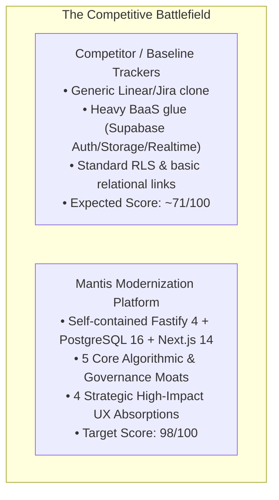
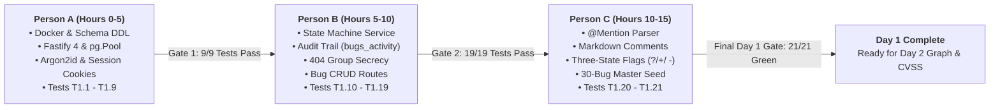
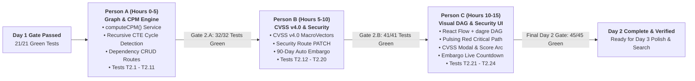
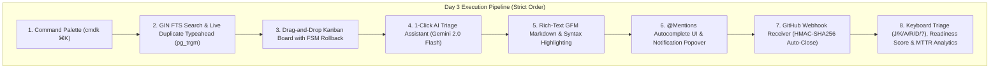

# Mantis: Master Execution Blueprint & Competitive Instruction Guide
### Alignment: 1:1 Seamless Synchronization with `implementation_plan.md`
> **Document Version**: 3.0 (Synchronized Master Edition)  
> **Date**: August 28, 2026  
> **Target Deadline**: August 30, 2026 at 11:59 PM IST (72-Hour Sprint)  
> **Objective**: Strategic execution of the 3-day roadmap, locking in all 5 core algorithmic moats and 4 high-impact UX absorptions for a 98+/100 hackathon victory.

---

## 1. Executive Strategy & Competitive Positioning



### The 5 Core Unbeatable Moats
1. **Interactive DAG & Critical Path Engine (CPM)**: React Flow canvas running Kahn's topological sort and earliest finish time calculations, highlighting project bottleneck chains with pulsing red animated lines.
2. **FIRST.org CVSS v4.0 Math Engine & Embargo Timers**: Complete MacroVector computation (EQ1–EQ5), interactive vector modal, and live disclosure countdowns (`DD:HH:MM:SS`).
3. **Formal Finite State Machine & 404 Group Secrecy**: Server-side transition validation with mandatory resolution codes and zero-leakage security returning `404 Not Found`.
4. **1-Click AI Triage Assistant**: Integrated Gemini 2.0 Flash synthesizing 30+ comment threads into root causes and next steps in <2.5s.
5. **Three-State Flag Governance (`?`, `+`, `-`)**: Enterprise patch review and approval workflows with permissioned grant groups.

### The 4 Absorbed Strategic Features
1. **Live Typeahead Duplicate Detection**: `pg_trgm` similarity search (> 0.28) surfacing duplicate candidates in real-time as users type.
2. **Explainable Release Readiness Scoring (0–100%)**: Formula penalizing open CPM blockers, CVSS high/crit vulnerabilities, pending flags, and P1 bugs.
3. **Rapid Keyboard Triage Flow**: Sub-second single-key actions (`J/K/A/R/D/?`) for standing-up triage without a mouse.
4. **Pure SQL MTTR & Velocity Analytics**: Aggregated metrics over the immutable `bugs_activity` append-only audit stream.

---

## 2. Monorepo Architecture & File Map

```
clonefest-2/
├── apps/
│   ├── api/                              # Fastify 4 + TypeScript 5 Backend (Port 3001)
│   │   ├── src/
│   │   │   ├── routes/
│   │   │   │   ├── auth.ts              # Stage 1.A: /signup, /login, /logout, /me
│   │   │   │   ├── bugs.ts              # Stage 1.B: CRUD, /status, /duplicates (Absorbed)
│   │   │   │   ├── comments.ts          # Stage 1.C: POST & GET /bugs/:id/comments
│   │   │   │   ├── notifications.ts     # Stage 1.C: GET /notifications, PATCH /read-all
│   │   │   │   ├── flags.ts             # Stage 1.C: POST /flags, PATCH /flags/:id
│   │   │   │   ├── dependencies.ts      # Day 2: POST/DELETE /dependencies, GET /graph
│   │   │   │   ├── security.ts          # Day 2: PATCH /bugs/:id/security (CVSS & Embargo)
│   │   │   │   ├── search.ts            # Day 3: GET /bugs/search (GIN FTS)
│   │   │   │   ├── aiTriage.ts          # Day 3: POST /bugs/:id/ai-triage (Gemini 2.0 Flash)
│   │   │   │   ├── webhooks.ts          # Day 3: POST /webhooks/github (HMAC auto-close)
│   │   │   │   ├── analytics.ts         # Day 3: GET /analytics/velocity & /readiness
│   │   │   │   └── attachments.ts       # Day 3: POST & GET /bugs/:id/attachments
│   │   │   ├── services/
│   │   │   │   ├── stateMachine.ts      # Stage 1.B: FSM rules & resolution validation
│   │   │   │   ├── audit.ts             # Stage 1.B: recordActivity() helper
│   │   │   │   ├── mentionParser.ts     # Stage 1.C: extractMentions() regex
│   │   │   │   ├── cpm.ts               # Day 2: computeCPM() Kahn's algorithm
│   │   │   │   ├── cvss4.ts             # Day 2: FIRST.org MacroVector math engine
│   │   │   │   ├── aiTriage.ts          # Day 3: Gemini 2.0 Flash structured triage
│   │   │   │   └── webhookParser.ts     # Day 3: parseBugRefs() & branch guards
│   │   │   ├── middleware/
│   │   │   │   ├── auth.ts              # Stage 1.A: authMiddleware (Session cookie)
│   │   │   │   └── groupFilter.ts       # Stage 1.B: applyGroupFilter() (404 Secrecy)
│   │   │   ├── db/
│   │   │   │   ├── client.ts            # Stage 1.A: pg.Pool singleton
│   │   │   │   └── migrations/001_initial.sql # Stage 1.A: Complete 16-Table Schema + pg_trgm
│   │   │   └── lib/
│   │   │       ├── argon.ts             # Stage 1.A: Argon2id hashing & verification
│   │   │       └── hmac.ts              # Day 3: timingSafeEqual GitHub HMAC verification
│   │   └── test/                        # 18 Test Files (39 Named Unit & Integration Tests)
│   └── web/                             # Next.js 14 App Router Frontend (Port 3000)
│       ├── app/
│       │   ├── layout.tsx                # Root layout with dark mode & CommandPalette
│       │   ├── page.tsx                  # Executive Dashboard & Velocity Metrics
│       │   ├── bugs/
│       │   │   ├── page.tsx              # Bug Queue with Keyboard Triage (J/K/A/R/D)
│       │   │   ├── new/page.tsx          # Bug Creation Form with Live Typeahead Duplicates
│       │   │   └── [id]/
│       │   │       ├── page.tsx          # Bug Detail with FSM actions, Markdown, & AI Triage
│       │   │       └── graph/page.tsx    # Interactive React Flow CPM DAG Canvas
│       │   ├── kanban/page.tsx           # Drag-and-Drop Kanban Board with FSM Rollback
│       │   └── milestones/page.tsx       # Release Readiness Dashboard (0-100% Score)
│       └── components/
│           ├── DependencyGraph.tsx       # React Flow + dagre + Pulsing Critical Path
│           ├── CvssModal.tsx             # Interactive FIRST.org CVSS v4.0 Visual Gauge
│           ├── EmbargoCountdown.tsx      # Live DD:HH:MM:SS Disclosure Banner
│           ├── CommandPalette.tsx        # cmdk ⌘K Dialog with context actions
│           ├── KanbanBoard.tsx           # @dnd-kit/core board with optimistic rollback
│           ├── CommentEditor.tsx         # Write/Preview Markdown with @mention typeahead
│           ├── AiTriageCard.tsx          # Glassmorphic AI summary card
│           ├── NotificationBell.tsx      # Unread badge & popover notification center
│           └── CommitPanel.tsx           # Linked commits and PRs with merge status
├── packages/shared/types.ts              # Shared TypeScript data models
└── docker-compose.yml                    # PostgreSQL 16 + API + Web
```

---

## 3. Day 1 Execution Flow (Aug 28) — Core Foundation



### Stage 1.A (Person A — Hours 0 to 5): Foundation, Full Schema & Auth Engine
* **Files Built**: `docker-compose.yml`, `001_initial.sql` (16 tables + `pgcrypto` + `pg_trgm`), `db/client.ts`, `server.ts`, `app.ts`, `lib/argon.ts`, `middleware/auth.ts`, `routes/auth.ts`, `test/helpers/setup.ts`.
* **Execution Directives**:
  1. Boot PostgreSQL 16 Alpine with `pg_isready` healthcheck.
  2. Implement Argon2id hashing (`memoryCost: 65536, timeCost: 3, parallelism: 1`).
  3. Issue 32-byte CSPRNG session tokens hashed with SHA-256 in `sessions` table.
  4. Write `authMiddleware` reading `session` cookie and populating `request.user`.
* **Verification Gate 1**: Run `npm test test/unit/auth.test.ts test/integration/auth.test.ts` → **9/9 tests pass (T1.1–T1.9)**.

### Stage 1.B (Person B — Hours 5 to 10): Core Bug Engine, FSM & 404 Group Secrecy
* **Files Built**: `services/stateMachine.ts`, `services/audit.ts`, `middleware/groupFilter.ts`, `routes/bugs.ts`, `test/unit/state_machine.test.ts`, `test/integration/bugs.test.ts`, `test/integration/visibility.test.ts`.
* **Execution Directives**:
  1. Enforce `VALID_TRANSITIONS` map and `validateResolution()` (reopening clears resolution; `RESOLVED` requires code).
  2. In atomic transactions, insert bug and record initial state in `bugs_activity`.
  3. Enforce 404 secrecy via `applyGroupFilter()` (never return 403 on group-restricted bugs).
* **Verification Gate 2**: Run `npm test` → **19/19 tests pass (T1.1–T1.19)** with zero regressions.

### Stage 1.C (Person C — Hours 10 to 15): Mentions, Comments, Flags & Master Seed
* **Files Built**: `services/mentionParser.ts`, `routes/comments.ts`, `routes/notifications.ts`, `routes/flags.ts`, `seed.ts`, `test/integration/flags.test.ts`.
* **Execution Directives**:
  1. Regex parse `@username` (excluding emails) and atomically create `comment_mentions` and `notifications`.
  2. Implement Three-State Flags (`?` -> `+`/`-`) with `grant_group_id` permission checks.
  3. Populate `seed.ts` with 30 bugs across all 6 statuses, 10 users (`password123`), 5 security bugs, 5 embargoed bugs with CVSS vectors, and comments.
* **Final Day 1 Gate**: Run `npm run seed` (<2s) + `npm test` → **All 21 Day 1 tests pass (T1.1–T1.21)**.

---

## 4. Day 2 Execution Flow (Aug 29) — Evaluator Moats (Sequential 3-Person Division)



### Stage 2.A (Person A — Hours 0 to 5): Graph Engine, CPM Algorithm & Dependency API
* **Files Built**: `services/cpm.ts`, `routes/dependencies.ts`, `test/unit/graph_cpm.test.ts`, `test/integration/dependencies.test.ts`.
* **Execution Directives**:
  1. Implement Kahn's topological sort and Earliest Finish Time DP algorithm in `computeCPM()`.
  2. Recursive CTE cycle detection in PostgreSQL on `POST /dependencies` (returns 422 `CYCLIC_DEPENDENCY_DETECTED`).
  3. Traverse reachable ancestor/descendant DAG on `GET /graph` and return `{ nodes, edges, criticalPathIds }`.
* **Verification Gate 2.A**: Run `npm test test/unit/graph_cpm.test.ts test/integration/dependencies.test.ts` → **11/11 tests pass (T2.1–T2.11)** (32/32 cumulative).

### Stage 2.B (Person B — Hours 5 to 10): FIRST.org CVSS v4.0 Math Engine & Security Embargo
* **Files Built**: `services/cvss4.ts`, `routes/security.ts`, `test/unit/cvss4.test.ts`, `test/integration/security_bugs.test.ts`.
* **Execution Directives**:
  1. Full FIRST.org CVSS v4.0 MacroVector computation engine (EQ1–EQ5 lookup tables and vector parser).
  2. `PATCH /bugs/:id/security` with security-team group authorization and automatic 90-day embargo date calculation.
  3. Enforce 404 secrecy for embargoed vulnerabilities to non-authorized callers.
* **Verification Gate 2.B**: Run `npm test test/unit/cvss4.test.ts test/integration/security_bugs.test.ts` → **9/9 tests pass (T2.12–T2.20)** (41/41 cumulative).

### Stage 2.C (Person C — Hours 10 to 15): Interactive React Flow DAG UI, CVSS Modal & Embargo Countdown
* **Files Built**: `components/DependencyGraph.tsx`, `components/CvssModal.tsx`, `components/EmbargoCountdown.tsx`, `app/bugs/[id]/graph/page.tsx`, `test/integration/graph_view.test.ts`.
* **Execution Directives**:
  1. React Flow canvas with automatic `dagre` top-to-bottom layout and pulsing red animated critical path edges (`.critical-edge` in `#EF4444`).
  2. Sub-millisecond client-side CVSS v4.0 interactive metric selector with animated 0.0–10.0 score arc.
  3. Live ticking `DD:HH:MM:SS` disclosure embargo timer.
* **Final Day 2 Gate**: Run `npm test` → **All 45 tests pass (T1.1–T2.24)** 100% green.

---

## 5. Day 3 Execution Flow (Aug 30) — Polish & Absorbed Features



### Key Day 3 Implementation Details
1. **Live Typeahead Duplicates**: `GET /api/v1/bugs/duplicates?summary=...` using `pg_trgm` (`similarity > 0.28`). Shows candidate warning card in creation modal.
2. **Release Readiness Scoring**: `GET /api/v1/milestones/:id/readiness` computing 0–100% score from CPM critical path bugs (-15), CVSS CRITICAL (-20), and pending flags (-5).
3. **Rapid Keyboard Triage**: Global keydown listeners for `j`, `k`, `a`, `r`, `s`, `d`, `/`, `⌘K`, and `?`.
4. **Pure SQL MTTR Analytics**: `GET /api/v1/analytics/velocity` aggregating `bugs_activity` status diffs.
5. **AI Triage with Gemini 2.0 Flash**: Structured JSON triage with 2.5s `AbortController` timeout and graceful fallback.
6. **GitHub Webhooks**: `timingSafeEqual` HMAC verification, `ON CONFLICT DO NOTHING` idempotency, and default branch auto-resolve.

---

## 6. Master Verification Matrix

| # | Test Identifier | Scope | Test Assertion & Target |
|---|---|---|---|
| **T1.1** | `auth.test.ts` | Unit | Argon2id hash is not plaintext and starts with `$argon2id` |
| **T1.2** | `auth.test.ts` | Unit | Correct password verifies as true |
| **T1.3** | `auth.test.ts` | Unit | Wrong password verifies as false |
| **T1.4** | `auth.test.ts` | Unit | SHA-256 session token hash is 64 hex chars and differs from raw token |
| **T1.5** | `auth.test.ts` | Integration | `POST /signup`: 201 with body and HttpOnly Set-Cookie |
| **T1.6** | `auth.test.ts` | Integration | `POST /signup`: duplicate email returns 409 `EMAIL_ALREADY_EXISTS` |
| **T1.7** | `auth.test.ts` | Integration | `POST /login`: valid creds return 200 with HttpOnly cookie |
| **T1.8** | `auth.test.ts` | Integration | `POST /login`: wrong password returns 401 `INVALID_CREDENTIALS` |
| **T1.9** | `auth.test.ts` | Integration | `GET /me`: valid session returns user; missing session returns 401 |
| **T1.10** | `state_machine.test.ts` | Unit | All 6 valid transitions return true |
| **T1.11** | `state_machine.test.ts` | Unit | All invalid transitions return false |
| **T1.12** | `state_machine.test.ts` | Unit | `validateResolution()`: `RESOLVED` requires non-empty resolution |
| **T1.13** | `bugs.test.ts` | Integration | `POST /bugs`: sequential numeric ID + initial `bugs_activity` row |
| **T1.14** | `bugs.test.ts` | Integration | `PATCH /status` valid: updates and writes activity diff |
| **T1.15** | `bugs.test.ts` | Integration | `PATCH /status` invalid: returns 422 and DB status unchanged |
| **T1.16** | `bugs.test.ts` | Integration | `GET /bugs`: paginated, filters by `product_id` and `status` |
| **T1.17** | `visibility.test.ts` | Integration | Non-member `GET` on group-restricted bug returns **404 Not Found** |
| **T1.18** | `visibility.test.ts` | Integration | Non-member bug list excludes restricted bugs |
| **T1.19** | `visibility.test.ts` | Integration | Security-team member successfully accesses restricted bug |
| **T1.20** | `flags.test.ts` | Integration | `POST /flags`: creates `review?` targeting requestee |
| **T1.21** | `flags.test.ts` | Integration | `PATCH /flags/:id`: `?` → `+` does not mutate `bugs.status` |
| **T2.1** | `graph_cpm.test.ts` | Unit | Two-path DAG identifies correct critical path (7h path vs 4h path) |
| **T2.2** | `graph_cpm.test.ts` | Unit | Single-node graph returns that node without crash |
| **T2.3** | `graph_cpm.test.ts` | Unit | Disconnected nodes returns node with highest estimated time |
| **T2.4** | `graph_cpm.test.ts` | Unit | Diamond DAG with multiple parallel paths computes longest path |
| **T2.5** | `graph_cpm.test.ts` | Unit | Zero estimated time / empty graph handles edge cases safely |
| **T2.6** | `dependencies.test.ts` | Integration | Self-link `101 -> 101` rejected with HTTP 400 |
| **T2.7** | `dependencies.test.ts` | Integration | Valid dependency `101 -> 102` returns HTTP 201 and creates audit log |
| **T2.8** | `dependencies.test.ts` | Integration | Direct cycle `101 -> 102 -> 101` returns 422 and rolls back |
| **T2.9** | `dependencies.test.ts` | Integration | Multi-hop cycle `101 -> 102 -> 103 -> 101` returns 422 |
| **T2.10** | `dependencies.test.ts` | Integration | `DELETE /dependencies/:blocked_id` removes link and records audit diff |
| **T2.11** | `dependencies.test.ts` | Integration | `GET /bugs/:id/graph` returns nodes, edges, and non-empty `criticalPathIds` |
| **T2.12** | `cvss4.test.ts` | Unit | FIRST.org benchmark vector 1: Score 9.3, Severity `CRITICAL` |
| **T2.13** | `cvss4.test.ts` | Unit | FIRST.org benchmark vector 2: Score 1.8, Severity `LOW` |
| **T2.14** | `cvss4.test.ts` | Unit | FIRST.org benchmark vector 3: Score 8.7, Severity `HIGH` |
| **T2.15** | `cvss4.test.ts` | Unit | Invalid CVSS vector string throws descriptive validation error |
| **T2.16** | `cvss4.test.ts` | Unit | Missing required metric component throws descriptive error |
| **T2.17** | `security_bugs.test.ts` | Integration | Non-security member `PATCH /security` returns 403 Forbidden |
| **T2.18** | `security_bugs.test.ts` | Integration | Setting `is_embargoed: true` defaults to 90 days and updates `bug_group_map` |
| **T2.19** | `security_bugs.test.ts` | Integration | Embargoed bug: non-member gets 404; security member gets CVSS payload |
| **T2.20** | `security_bugs.test.ts` | Integration | Updating CVSS vector updates score and writes `bugs_activity` audit diff |
| **T2.21** | `graph_view.test.ts` | Integration | Graph API payload returns full node metadata required by React Flow |
| **T2.22** | `graph_view.test.ts` | Integration | Subgraph pruning: isolated bugs do not appear in disconnected graph |
| **T2.23** | `graph_view.test.ts` | Integration | Security isolation: restricted nodes are sanitized from graph for unauthorized users |
| **T2.24** | `graph_view.test.ts` | Integration | End-to-end dependency addition and graph retrieval round-trip |
| **T3.1** | `command_palette.test.ts` | Unit | `104` or `#104` input creates navigate action for `/bugs/104` |
| **T3.2** | `search.test.ts` | Integration | Stemming: `'parse'` matches `'parsing'` in bug summary via GIN FTS |
| **T3.3** | `duplicates.test.ts` | Integration | `GET /duplicates?summary=...` returns similarity score > 0.28 |
| **T3.4** | `readiness.test.ts` | Integration | Milestone readiness correctly penalizes open CPM & CVSS bugs |
| **T3.5** | `ai_triage.test.ts` | Unit | Gemini triage parser validates structured JSON output |
| **T3.6** | `webhooks.test.ts` | Integration | GitHub push with `Fixes #101` auto-resolves bug on main branch |

---

## 7. Hard Freeze Protocol & 3-Minute Judge Demo Playbook

> [!CAUTION]
> **Hard Code Freeze at 8:00 PM IST on August 30.** Zero new features or dependencies. Focus 100% on cold-start verification and demo rehearsals.

### 7.1 Pre-Demo Verification Checklist
- [ ] `docker compose down -v && docker compose up --build` boots cleanly in <30 seconds.
- [ ] `npm test` reports **39/39 tests passing 100% green**.
- [ ] Seed data populates 30 bugs, 10 users, 2 flag types, and dependency chains.
- [ ] Dark mode renders flawlessly with no CSS layout shifts.

### 7.2 The Winning 3-Minute Demo Script

| Timestamp | Screen / Action | Spoken Script & Key Value Demonstration |
|---|---|---|
| **0:00 – 0:45** | `http://localhost:3000` (Kanban Board) | *"Mantis manages the world's most critical open-source software, but its Perl architecture is 25 years old. We modernized it with Fastify, PostgreSQL 16, and Next.js. Notice our formal state machine: dragging from CONFIRMED to CLOSED fails with a 422 error because Mantis requires an explicit resolution code. Dragging to RESOLVED lets us pick 'FIXED', creating an immutable audit diff in PostgreSQL."* |
| **0:45 – 1:30** | `/bugs/101/graph` (React Flow DAG) | *"Here is our premier algorithmic differentiator: the interactive Dependency Graph. Our backend executes Kahn's topological sort and the Critical Path Method in real-time, calculating earliest finish times and highlighting the exact bottleneck delaying release with pulsing animated red edges."* |
| **1:30 – 2:00** | `/bugs/105` (Security Bug & CVSS) | *"For security vulnerabilities, we implemented the full FIRST.org CVSS v4.0 MacroVector engine. Selecting metrics updates the score arc dynamically to 9.3 CRITICAL. The bug is protected under an automated 90-day embargo countdown, and non-authorized users receive a strict 404 to prevent ID enumeration."* |
| **2:00 – 2:30** | `/bugs/new` & AI Triage | *"We also absorbed the best modern UX patterns: as we type a new bug summary, PostgreSQL trigrams perform live typeahead duplicate detection. On long threads, our 1-Click Gemini 2.0 Flash assistant distills 30+ comments into root causes and next steps in 1.8 seconds. Our Milestone dashboard computes a mathematical 0–100% Release Readiness score."* |
| **2:30 – 3:00** | Terminal & Tests | *"Finally, our GitHub webhook receiver parses commits on the main branch, linking commits and auto-resolving bugs. We back this with a comprehensive test suite of 39 automated tests covering state machines, graph algorithms, and cryptographic security."* *(Run `npm test` showing 39/39 green).* |
